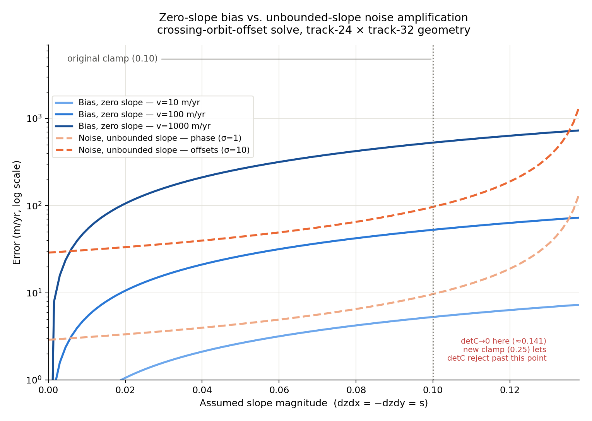

# CLAUDE.md — mosaicSource

Supplements the root `/Users/ian/progs/GIT64/CLAUDE.md`. This directory holds the velocity-mosaic
programs and the `common/` library they all link against.

## Programs

Each program has its own subdirectory and its own `make <target>` rule in `mosaicSource/Makefile`
(run from `mosaicSource/`, e.g. `make mosaic3d ROOTDIR=... PROGDIR=... BINDIR=...`).

| Binary | Source dir | Purpose | Doc |
|---|---|---|---|
| `mosaic3d` | `Mosaic3d/` | Main velocity mosaic driver (speckle, phase, crossing-orbit, Landsat) | `Documents/mosaic3d.md` |
| `geomosaic` | `geoMosaic/` | Calibrated/uncalibrated SAR image mosaics | `Documents/geomosaic.md` |
| `siminsar` | `simInSAR/` | Simulates offset/phase products | `Documents/simInSAR.md` |
| `rparams` | `rParams/` | Baseline params for range offsets | `Documents/rparams.md` |
| `azparams` | `azParams/` | Calibration params for azimuth offsets | `Documents/azparams.md` |
| `tiepoints` | `tiePoints/` | Baseline params from unwrapped interferogram + GCPs | — |
| `lltora` | `LLtoRA/` | lat/lon/z → range/azimuth for a SAR image | `Documents/lltora.md` |
| `getlocc` | `getLocC/` | Builds a `geodat` metadata file for a multi-look product | `Documents/getLocC.md` |
| `coarsereg` | `coarseReg/` | Coarse range/azimuth alignment of two SLCs from metadata | — |
| `computebaseline` | `computeBaseline/` | Standalone baseline computation | `Documents/computeBaseline.md` |
| `offsetvrt` | `offsetVRT/` | VRT offset utility | — |
| `testgeo` | `testGeo/` | Geocoding test harness (not a production tool) | — |

`make all` builds the `TARGETS` set: `mosaic3d siminsar rparams azparams coarsereg tiepoints lltora
getlocc geomosaic` (does not include `computebaseline`, `offsetvrt`, `testgeo` — build those
individually).

## Shared code

- **`common/`** — ~45 source files used by every program above (geocoding, interpolation,
  baselines, DEM/tie-point/coordinate handling). See `Documents/common.md`. Changes here ripple
  into every binary's `make` target — rebuild affected programs, not just the one you're working on.
- **`landsatMosaic/`** — Landsat velocity integration, linked into `mosaic3d` and `geomosaic` only.

## RTC / sub-pixel radiometric terrain correction (`geoMosaic/`)

`subpixelRTC.c`, `linearSubpixelRTC.c`, `jacobianSubpixelRTC.c` implement three flavors of
sub-pixel RTC, all building cleanly. `-maskLayover` (global `int32_t maskLayover` in
`geomosaic.c`) suppresses layover pixels (output MINS1DB = -30 dB) in all three:
- `jacobianSubpixelRTC.c`: without flag, suppress when `nLayover > nValid/2`; with flag, suppress
  when `nLayover > 0` (any layover sub-pixel).
- `linearSubpixelRTC.c` / `subpixelRTC.c`: with flag, compute pixel-level Jacobian sign and
  compare against `inputImage->passType` (see root CLAUDE.md sign-convention note).

**Open investigation:** all three RTC flavors remain several dB brighter than NISAR GCOV in
steep/layover terrain. Root cause: map→SLC architecture — multiple output map pixels
independently read the same SLC bin in layover, each applying its own Ab/Ag correction, so
energy is double-counted. NISAR GCOV uses SLC→map accumulation (distributes energy once). A
two-pass multiplicity fix would be theoretically correct but ~2x cost and requires restructuring
the sub-pixel functions; not implemented — may not be worth it since layover pixels have no
recoverable signal anyway. Flat-terrain comparisons (no layover) are good; residual foreshortening
differences are likely DEM-related (datum/geoid/resampling vs Copernicus GLO-30/90), not algorithm.
Next step when revisiting: run with `-maskLayover` and re-compare against NISAR GCOV.

## geomosaic near/far range selection (`-nearRange` / `-farRange`)

Keeps only the inputs whose ellipsoidal incidence angle is within `-angleTolerance` (default 1 deg)
of the per-pixel min or max, for both range/Doppler and GCOV inputs. Off by default and
byte-identical to before when unused. Full description: `Documents/geomosaic.md`.

Traps:
- **Single pass does not work** - the running extremum makes the result depend on input file
  order. Pass 1 establishes the extremum over all inputs first, on a coarse grid (`-angleStride`,
  default 10 output pixels), reading no image data.
- **Pass 1 sees geometry, not data**, so it can pick an input with no valid pixel there. A second,
  unfiltered accumulator is kept and any pixel the filter empties falls back to it, so coverage is
  identical to the plain mosaic by construction. The fallback rate is logged; it should be a
  fraction of a percent.
- **Pass 1 must apply exactly pass 2's validity test.** Accepting GCOV `mask != 255` rather than
  `mask == 1` over-claims coverage and drove the far-range fallback from 0.3% to 11.6%.
- **The unfiltered accumulator needs its own psi/gamma planes.** Sharing `psiBuf`/`gBuf` lets a
  later file's unfiltered pass overwrite them, pairing selected sigma0 with an unselected gamma
  correction in `.gamma0`.
- **`lastTime` must be saved and restored** around the pass-1 geocoding, or the warm start moves
  and a no-flag run stops being byte-identical.
- `-min`/`-max`, `-ascending`/`-descending` and `-nearestDate` are refused: the first compares
  feathered values, the others key off the scale buffer the fallback test reads.

## NISAR GCOV inputs to geomosaic (`-gcov`, `geoMosaic/gcovMosaic.c`)

`geomosaic -gcov file.yaml` mosaics already-geocoded NISAR GCOV HDF5 products, read directly
through GDAL's HDF5 driver, either alongside range/Doppler images or instead of them (with
`nFiles` 0 in the input list). They are added in a stage after the range/Doppler loop in
`makeGeoMosaic`, reusing the same `computeScale`/`geoMosaicScaling` accumulation.
`-calOutput sigma0|gamma0|both` selects the `-S1Cal` outputs; the default `both` is unchanged.
Full description and verification are in `Documents/geomosaic.md` "NISAR GCOV Inputs".

**`factorFrom: <dir>` (yaml key, optional)** reads `rtcGammaToSigmaFactor` from outside the
granule, so slim products can share one factor per track/frame/grid across cycles instead of
storing ~830 MB (240 MB as fp16) in every one. `openGCOV` opens
`<factorFrom>/<granule basename>`; the downloader leaves a per-granule **symlink** there pointing
at the shared file, so the C never has to derive the sharing key. Absent (the default) the factor
comes from the granule exactly as before — verified pixel- and metadata-identical.

Why a path and not an HDF5 **virtual dataset**, which would need no code change: a VDS is free on
GDAL 3.9/HDF5 1.14.3 (0.31 s vs 0.30 s on a 2048² read) and **catastrophic on GDAL 3.11.5/HDF5
2.2.0 — 213.78 s against 0.07 s**, a ~3000x regression with ~71 GB of logical reads for a 107 MB
window, unchanged by `GDAL_NUM_THREADS=1`. h5py reads the same file in 0.03 s under both, so it is
specific to HDF5 2.2.0's VDS path as GDAL 3.11 drives it. A VDS also fails **silently**: an
unresolvable source returns the fill value (0.0), which `reduceGCOV:793-801` drops *before*
`gSum += gv`, so the granule contributes neither sigma0 nor gamma0 and feathering hides it. An
explicit path turns that into a `GDALOpen` failure.

`openGCOV` also rejects a factor whose raster size differs from the gamma band — 173 of 657
cycle-030 granules are partial frames, so a position that is partial in one cycle and full in the
next has a different grid, and reading the factor at the same pixel window would silently
misregister the gamma→sigma conversion.

**float16 fast path (automatic, no flag).** Slim GCOV products store the covariance term and the
RTC factor as float16. GDAL reports such a band as Float32 and has libhdf5 convert it, which lands
in a generic software conversion. `gcovMosaic.c` detects a 16-bit float dataset in `openGCOV`,
opens it directly with libhdf5, reads the window **using the file's own datatype as the memory
type** (so HDF5 copies bits instead of converting) and expands it through a 65536-entry lookup
table. Measured on a 16 Mpx window: GDAL float32 0.277 s, GDAL float16 1.273 s, this path 0.179 s.

End to end on a 300x300 km box, a slim fp16 product went **108 s -> 22.2 s, i.e. ~5% FASTER than
the float32 archive product** (23.5 s), with the float32 path pixel-identical to before.

- A lookup table, not F16C intrinsics, so no architecture-specific compiler flag is needed and
  arm64 still builds.
- Safe without locking because **the GCOV read is serial within a process** — the loop at
  `makeGeoMosaic.c:866` is a plain `for`, and `gcovMosaic.c`'s OpenMP regions begin after
  `reduceGCOV` returns. Production parallelism is separate geomosaic processes, one per tile.
  If that loop is ever parallelised, this needs a mutex: system libhdf5 is not built thread-safe.
- `-I/usr/include/hdf5/serial` and `-lhdf5_serial` are needed in **both** `mosaicSource/Makefile`
  places (CFLAGS/CCFLAGS and the `geomosaic:` link rule), the same two-location trap as `-fopenmp`.
- This removes the whole reason to upgrade GDAL for fp16: GDAL 3.11.5/HDF5 2.2.0 reads fp16 in
  0.227 s, which this beats, on the GDAL 3.8.4/HDF5 1.10.10 already installed.

Traps:
- **GDAL gives GCOV subdatasets no geotransform or CRS.** The grid comes from
  `xCoordinates`/`yCoordinates` (pixel centres) plus the file-level `..._projection_epsg_code`
  attribute. Scalar datasets such as `xCoordinateSpacing` and `zeroDopplerStartTime` are not
  exposed through GDAL at all, so the date and pass direction come from the file name.
- **Read in large strips.** The layers are gzip-compressed in 512×512 chunks. Reading `k` rows
  at a time re-decompresses each chunk row about 512/k times: 493 s vs 34 s per frame.
- The GCOV `mask` is a valid-sample / subswath mask (0 = invalid, 255 = fill), **not** a
  layover/shadow mask.
- `rtcGammaToSigmaFactor` can be negative or huge (seen: -59 to 3740). Samples with a factor
  that is not positive and finite are dropped from both averages, so γ₀/σ₀ stays consistent.

## ISCE/NISAR flat-earth baseline (`tiePoints/`, `common/`)

See root CLAUDE.md "ISCE/NISAR flat-earth baseline path" for the overview. Implementation:
- `tiePoints/tiepoints.c` — `-yaml` flag
- `tiePoints/computeBaseline.c` — YAML output branch (`applyFlatEarth: true` + Bn/Bp/dBn/dBp/sigma/nTiepoints/nDays)
- `common/getBaseline.c` — `.yaml` extension detection + key:value parsing
- `common/common.h` — `vhParams.applyFlatEarth` (int32_t)
- `common/computePhiFlatEarth.c` — flat-earth phase function used by `makeVhMosaic.c`
- `Mosaic3d/make3DMosaic.c` — `computePhiFlatEarthM3d`, pixel loop branches on the flag

Sample CLI: `tiepoints -bpOnly -nDays $nDays -motion -center -noDEM -dBp -yaml ../geodat30x6.in
$tiefile $phasefile baselines.orig > baseline.30x6.yaml`, then pass the original ISCE phase +
`baseline.30x6.yaml` directly to `mosaic3d` (no `changeflat` step).

## Ionosphere correction on the phase path (`tiepoints -ionosphere`, `Mosaic3d/`)

The phase-side counterpart of `rparams`' ION_AUTO (see `rParams/rparams.c:294-350`), added for
Sentinel-1: ISCE's `topsApp` split-spectrum step produces an ionospheric phase screen
(`merged/topophase.ion`), which `Sentinel1Phase/setupisceuw.py` already exports into the GrIMP
product directory as `ionosphere.tif`. Nothing consumed it before. NISAR is unaffected — without
`-ionosphere` the behaviour is exactly as it was.

**`tiepoints` flags** (names deliberately match `rparams`; defined in `tiePoints/tiePoints.h`):
`-ionosphere <file>` (absent = old behaviour), `-noIonosphere` (ION_NONE), `-forceIonosphere`
(ION_FORCE), `-ionSigmaMargin <frac>` (default `IONSIGMAMARGIN` = 0.05). Default with a file
given is ION_AUTO. Note `readArgs`'s `argc` guard had to go 20 → 28, and the flag loop uses
`strstr`, so the four new branches are ordered longest-first.

**Sign: SUBTRACT.** The file holds the ionospheric phase itself, in the same sign convention as
the phase image it accompanies, so `phaseCorrected = phase - ion`. This is ISCE's own convention —
`runMergeBursts.py` applies its screen as `a*exp(-1.0*J*b)` with `b = topophase.ion`. It is the
**opposite** of the range-offset ionosphere correction (`rParams/getROffsets.c`,
`Mosaic3d/make3DOffsets.c`), which is a pre-negated *correction* that gets added — see root
CLAUDE.md. Both new apply sites carry a comment saying so.

**Python-side gotcha (not fixable in C):** `setupisceuw.py` writes the GrIMP phase as
`mySign * unw` where `mySign = sign(date2 - date1)`, but writes `ionosphere.tif` with **no**
`mySign`. For pairs with `mySign == -1` the exported screen is sign-flipped relative to its own
phase. The C code assumes the two share a convention and cannot detect a violation.

**Flow:**
- `tiePoints/getPhases.c` — the image read is factored into `readRadarImage()` (GDAL for
  `.vrt`/`.tif`, `freadBS` otherwise, hard error on a dimension mismatch); new `getIonosphere()`
  samples the screen with the *same* `interpolatePhase(r[i], a[i], ...)` bilinear call into
  `tiePoints->ionPhase` (`common/common.h`, alongside `phaseSquint`).
- Sampling once up front is equivalent to sampling after the corrections, because every downstream
  correction (`addBaselineCorrections.c:261`, `addMotionCorrections.c:106`) is a purely additive
  perturbation of `phase[]` independent of its value.
- `tiePoints/computeBaseline.c` — `computeBaseline()` runs `fitBaseline()` a second time on
  `phase - ionPhase` and keeps the winner in `noSquintFit`, so everything downstream is unchanged.
  Rule: ION_FORCE, or the uncorrected fit found no solution → use ion; otherwise
  `sigmaIon < sigmaNoIon * (1 - margin)`. `-debug` writes only the winner's residuals.
- Output — YAML gains four flat top-level keys before `noSquint:` (`ionosphereCorrectionFile`,
  which is `nil` when unused; `usingIon`; and, when both fits ran, `sigmaWithIonCorrection` /
  `sigmaWithoutIonCorrection`), emitted on the `sigma: -1` sentinel path too. Legacy text output
  gains `;* ionosphereCorrectionFile <path>` after the `&`, only when the correction won.
- `common/getBaseline.c` — `setIonospherePhaseFile()` parses both formats into
  `vhParams.ionospherePhaseFile`, resolving a relative name against the **baseline file's own
  directory** (absolute used as-is) and hard-erroring if it does not exist.
- `Mosaic3d/setup3D.c` copies it onto `inputImageStructure.ionospherePhaseFile`
  (`common/geocode.h`, next to `image`), clears it on the `sigma<0` → `nophase` downgrade, and
  `allocateOffsetBuffers()`/`setupADImageBuffers()` allocate the `AIonBuffer`/`DIonBuffer` pools
  (`common/buffers.c`) **only** when some baseline actually named a correction — so runs without
  one have exactly their old memory footprint. `ionospherePhase == NULL` is what tells the pixel
  loops there is no correction.
- `common/readOffsets.c:getIonospherePhaseImage()` reads it, honoring the same
  `yMin/nAzimuthLooks .. yMax/nAzimuthLooks` window as `getMosaicInputImage()`. It opens with
  `GDALOpen` **directly** rather than via `checkForVrt()`, so a plain `.tif` works with no `.vrt`
  wrapper — `checkForVrt()` would have silently fallen through to the raw big-endian path. A NULL
  `buf` means "keep the pool `setupADImageBuffers` assigned", which is what `makeVhMosaic.c` needs
  since it never calls `setBuffer()`.
- Applied via `interpIonPhaseImage()` (`common/interpPhaseImage.c`) in the **radians** domain,
  right after the `phase - phiZ` topography removal and before the velocity scaling:
  `make3DMosaic.c` (both `aPhase` and `dPhase`) and `makeVhMosaic.c`. No mosaic3d CLI flag —
  it unconditionally honours what the baseline file recorded, exactly as the offsets side does.
  `make3DOffsets.c`/`speckleTrackMosaic.c` are untouched.

**Verified** (2026-08-20, real NISAR frame `shadow/track-1/4252_0000`): a no-flag rerun differs
from the committed `baseline.26x16.yaml` only by the two new lines, with numeric drift inside
`tiepoints`' own run-to-run spread (two consecutive runs of the *same* binary differ by ~8e-5 in
sigma — the nondeterminism documented for `rparams`/`azparams` applies here too). A zero screen
gives bit-identical sigmas and correctly loses under AUTO / wins under `-forceIonosphere`. A
synthetic azimuth-varying screen added to the phase is recovered exactly: sigma 7.036 (uncorrected)
→ 3.271 and `Bp` 0.02968 vs the uncorrupted frame's 3.275 / 0.02959; `-ionSigmaMargin 0.99`
correctly rejects it. `mosaic3d` round-trips both baseline formats, resolves the relative path,
allocates the ion pools only when needed, and shifts velocities by ~0.94 m/yr per radian of screen.

**Not yet exercised:** the `make3DMosaic.c` (crossing asc/desc pair) apply site — the verification
above only drove `makeVhMosaic.c`, since no crossing phase pair with a correction was available.
The code is symmetric with the `makeVhMosaic.c` path that was verified.

## Azimuth ionosphere correction (`azparams` ION_AUTO, `mosaic3d -useAzIonosphere`)

The azimuth counterpart of `rparams`' range ION_AUTO. The ionosphere shifts targets in azimuth
in proportion to the ALONG-TRACK gradient of its range delay (a slow-time-linear phase
perturbation is a Doppler shift, and azimuth compression turns a Doppler shift into a
misregistration). `nisargrimpworkflow.azIonoCorrection` builds the screen; the C side fits with
it and applies it.

**`azparams` flags** (names deliberately match `rparams`): `-noIonosphere` (ION_NONE),
`-forceIonosphere` (ION_FORCE), `-ionSigmaMargin frac` (default 0.05). Default is ION_AUTO --
fit both ways, keep the correction only if `sigmaIon < sigmaNoIon * (1 - margin)`. Both sigmas,
`usingIon`, and `ionosphereAzimuthOffsetCorrection` go into `az.est.yaml`.
`fitAzParamsWithIonChoice()` (`azParams/azparams.c`) is the dual-run helper, used by both the
single-run and `-runFile` paths. `computeAzParams()` had to start RETURNING its sigma
(previously `void`) so the helper can choose; `-1.0` is the no-solution sentinel and is never
allowed to win.

**`mosaic3d -useAzIonosphere`** (default off) applies it at the five azimuth-offset sites
(`speckleTrackMosaic.c`, `makeVhMosaic.c`, `mosaicTrue3D.c`, `mosaicHopper.c`,
`mosaicHopper3D.c`) via the single helper `azIonCorrectionMeters()`. `make3DOffsets.c` /
`make3DOffsetsJoint.c` are untouched -- they solve from crossing-orbit RANGE offsets only.

**The consistency rule is the whole design.** `readAzParamsYaml()` records the correction name
ONLY when the fit says `usingIon: True`, and `loadAzimuthIonosphereCorrection()` then validates
that name against the VRT's own key before loading. A frame fitted without the correction can
never be corrected retroactively, so the fitted parameters and the applied screen always agree.

**Plumbing trap:** `getAzParams()` runs AFTER the rasters are read
(`readOffsetDataAndParams`), so the in-line `checkForAzimuthIonosphereCorrection()` inside
`readOffsetsOptionalErrors` cannot see the name the fit recorded -- that path only fires for
`azparams` itself, which pre-fills `correctionFile` by peeking at the VRT. mosaic3d needs the
explicit `loadAzimuthIonosphereCorrection()` call after `getAzParams`. Removing either one
silently disables the feature for one of the two binaries.

**A point with no correction is KEPT, uncorrected** (`azParams/getOffsets.c`), matching
`getROffsets`. Dropping such points instead -- which an earlier Python harness did implicitly,
by adding a NaN correction to a valid offset -- fits the two arms of the comparison to different
tie-point subsets and inflated the measured benefit roughly 2x (22.7% -> 15.4% on
track-99/5561_0010, 648 points both arms instead of 362 vs 648).

**Measured** (all 670 Greenland master frames, 2026-09-12): accepted on 241/669 (36%), median
14.6% sigma reduction where accepted, mean 6.3% across all frames, median 0.0%. The frames the
gate REJECTS would have been ~19% worse at the median, so it discriminates rather than
rubber-stamps.

**Validated against GPS and found to make no measurable difference -- and the reason matters
more than the result.** Two `validationReports` arms (`greenland-azIonRef` /
`greenland-azIonTest`, both fresh from the same binary and tie points, differing only in the
ionosphere flag) gave essentially identical residuals: slow RMS(r) vx/vy/speed 0.90/0.71/0.85 ->
0.91/0.70/0.85, fast 0.60/0.35/0.48 -> 0.61/0.36/0.49, seasonal unchanged.

This was NOT a null application. 616 of 1613 azimuth observations moved, median 18.4 m/yr and up
to 228; range and phase moved on 0 of 4664 rows, which is the correct sanity check. The velocity
did not move because **azimuth offsets carry 0.05-0.35% of the solve weight at every one of the
65 validation points** (median azimuth sigma 42.8 m/yr against phase 2.2, so ~375x less weight
per observation; phase takes 80-94%, range 6-21%). Even at the fast NIL stations, where phase is
scarcest, azimuth reaches only 0.35%.

**Azimuth-only solve (the sensitive test).** Re-solving the same dumps from AZIMUTH ROWS ONLY
removes the 0.1 % dilution and shows the correction plainly (62 validation points, cumulative
full-record estimate, NISAR and GPS solved on identical rows/weights via `obsDump.solve2D`):

| subset | RMS dspeed ref -> test | points improved |
|---|---|---|
| azimuth only | 20.11 -> 15.73 m/yr (**+21.8 %**), median 13.86 -> 8.77 | 42/62 (68 %) |
| offsets only (range+azimuth) | 9.81 -> 10.56 (**-7.6 %**) | 16/62 (26 %) |
| full solution | 3.01 -> 3.04 (-1.2 %) | - |
| range only / phase only | identical to 0.00 | control: correction touches azimuth alone |

So the correction genuinely improves the azimuth observable -- broadly, 17-30 % across every
speed bin below 200 m/yr -- and yet makes an offsets-only product WORSE. The likely mechanism is
that azimuth and range residuals share the ionosphere screen's own error (the azimuth screen is
the along-track derivative of the range screen that already corrected range), so removing it from
azimuth alone breaks a partial cancellation the joint solve was benefiting from. Do not assume an
improvement to one observable carries into a combined product.

Absolute scale matters too: azimuth-only RMS dspeed is ~16 m/yr against 2.95 range-only and 2.59
phase-only, so azimuth is never competitive as a product on its own at these points, corrected or
not. Only 3 points exceed 200 m/yr (those got worse), far too few to test whether fast shearing
ice behaves differently.

**Full-Greenland azimuth-only mosaics (2026-09-12/13) -- INCONCLUSIVE, to be redone.** Three
48-tile mosaics were built differing only in row selection: `azOnly-ion`, `azOnly-noIon`,
`rangeOnly` (all `-hopper3D -hopper3DMaxSigma -1 -gateAbsolute`; row flags are honoured ONLY by
the hoppers and `mosaicTrue3D`, never by the default joint solvers). 51.4 M common pixels.

Median |az - range| goes 2.32 -> 2.26 m/yr with the correction, which sounds negligible but is
just the flat interior dominating: the same statistic is 45 m/yr around Jakobshavn and 226 m/yr
on ice faster than 300 m/yr. By speed the correction helps slow ice in the TAIL (0-10 m/yr band:
p90 11.2 -> 9.4, p99 30 -> 25) and degrades everything above 50 m/yr, worsening with speed
(-10.6 % median at 300-1000 m/yr). Only 33 % of pixels move closer to the reference.

**Why it is inconclusive:** azimuth-only is far too noisy to arbitrate. Around Jakobshavn
azimuth-only reads systematically 50-200 m/yr SLOWER than range-only across the whole catchment
-- a coherent bias tens of times the ~3 m/yr formal errors -- so the reference and the test
disagree for reasons that have nothing to do with the ionosphere (stale DEM breaking the
surface-parallel projection on a much-thinned glacier, and possibly an azimuth calibration bias;
the bias covers the flat catchment interior too, so slope alone does not explain it). "Further
from range-only" therefore does not mean "worse". Redo when more cycles have accumulated and the
azimuth-only solve is better conditioned.

**To redo it** everything is in place under `azIonoTest/`: `runAzMosaics.sh` drives all three
variants and swaps the tie set; `swapAzFits.py` moves the live `az.est.azIon*` set between the
`.REF` (correction suppressed) and `.AUTO` (ION_AUTO) states; `makeAzIonTies.py --master <file>
[--noIonosphere]` regenerates either arm. Each mosaic took ~70 min, not the ~20 assumed -- start
before ~21:00 to clear the 01:00 Greenland nightly.

So the correction is real physics, correctly implemented and sensibly gated, acting on an
observable that is nearly irrelevant to the Greenland velocity product wherever phase exists.
Do not re-run a GPS comparison expecting a different answer -- the test is structurally
insensitive by a factor of ~1000. The open question the GPS sites CANNOT answer is whether
azimuth carries real weight where phase is absent (fast shearing outlets that do not unwrap);
that needs a full-mosaic weight census, not more validation points.

## Vertical correction for submergence/emergence (`-verticalCorrection`, `Mosaic3d/`)

`mosaic3d -verticalCorrection vcFile` supplies a vertical-velocity grid (m/yr, `xyDEM` format read
by `readXYDEM`) — typically the ice-equivalent submergence/emergence rate derived from SMB, i.e.
the rate at which the ice surface moves vertically relative to horizontal flow. This vertical
motion contributes a LOS component to InSAR phase and speckle-tracked range offsets that must be
removed before solving for horizontal velocity.

- CLI flags: `-verticalCorrection vcFile` (`mosaic3d.c` ~1212) and `-verticalCorrectionSuffix
  suffix` (~1207) — the suffix check must come first since `verticalCorrection` is a substring of
  `verticalCorrectionSuffix`.
- `vcFile` → `outputImage->verticalCorrection` (`xyDEM *`, `common/geocode.h`), read once in
  `mosaic3d.c` main via `readXYDEM`.
- `common/interpVCorrect.c` — `interpVCorrect(x, y, vCorrect)` bilinearly interpolates
  `vCorrect->z` at (x,y) in km; returns `0.0` if the interpolated value is `<= MINVCORRECT` (`-100`,
  the nodata sentinel for this grid, `common/common.h`).

### Sign convention

Applied in all four velocity pixel loops with the same `X -= -dzdtSubmergence * cos(psi) * scale`
idiom (≡ `X += dzdtSubmergence * cos(psi) * scale`) used for the SHELF `tideCorrection` in the same
loops — `dzdtSubmergence` follows `tideCorrection`'s sign convention. `psi`/`aPsi`/`dPsi` is the
local incidence angle from nadir, so `cos(psi)` projects the vertical rate onto the LOS
(complementary to `sin(psi)`, used to convert LOS phase/offset to horizontal velocity).

- `Mosaic3d/make3DMosaic.c` (~308-310): `aPhase += dzdtSubmergence*cos(aPsi)*twokA*nDays/365.25`,
  and the same for `dPhase`/`dPsi`/`twokD` — applied to both ascending and descending phases
  before `computeVxy`.
- `Mosaic3d/make3DOffsets.c` (~321-323): same form applied to `aDelta`/`dDelta` (no `twok`, since
  these are range offsets in metres, not phase).
- `Mosaic3d/speckleTrackMosaic.c` (~257-258): `dr += dzdtSubmergence*cos(psi)*nDays/365.25`,
  applied to the range offset before computing `vr`.
- `Mosaic3d/makeVhMosaic.c` (~229-230): `delta += dzdtSubmergence*cos(psi)` — no `nDays/365.25`
  here because `delta` is already annualized (m/yr) via `scalePhase`.

`Mosaic3d/writeTieFile.c` (~105) uses the same grid (passed in as `vzCorrect`) additively when
writing tie points: `vz = vZimage[i][j] + interpVCorrect(x, y, vzCorrect)`.

### `-verticalCorrectionSuffix`

Companion to the per-pixel grid above, not independent of it: `rParams`/baseline fitting (and the
tiepoints behind it) is itself sensitive to the assumed submergence/emergence rate, so each
scenario needs its own baseline solution. The standard run uses the default tiepoints/baseline
fit; an alternate scenario (different `-verticalCorrection` grid) is run with tiepoints chosen for
that scenario, producing a second, suffix-named set of baseline/rParams files alongside the
originals. The phase file itself is unaffected by the vertical-correction scenario and is shared
unchanged between them. `-verticalCorrectionSuffix` selects the alternate baseline/rParams set so
it stays paired with the matching `-verticalCorrection vcFile`, without duplicating the whole
input list.

Mechanically: appends `.<suffix>` to the **baseline** filename only (not phase) in
`common/getMVhInputFile.c` (`appendBaselineSuffix`), and to the **rParams** filename via
`RgOffsetsParamName` in `common/readOffsets.c` (inserted before the existing `.deltabp`/`.quad`
deltaB suffix). Propagated via `dumParams->offsets.verticalCorrectionSuffix =
outputImage->verticalCorrectionSuffix` in `Mosaic3d/setup3D.c`.

## Squint: DO NOT ENABLE — resolved 2026-08-31, `-useSquint` should stay off

**The correction is misdirected. Applying it injects ~1.6 deg of rotation error.** Verified against
GPS (5 stations, Jakobshavn, `Documents/nilGpsFindings.md`) and traced to root cause in the ISCE3
source. Full record: `Documents/solverComparison.md` §12.8.

The short version, because this is easy to re-derive backwards:

- The measured 1.5-1.7 deg squint **is real and correctly extracted** — it is the native-Doppler
  antenna squint. `metadataCubes.cpp:796-820` builds `losUnitVector`/`alongTrackUnitVector` at
  `native_azimuth_time`, solved with `native_doppler`; `InSAR_L1_writer.py:72-78` passes
  `grid_doppler = LUT2d()` (zero) separately for the grid.
- **But the phase is on the zero-Doppler grid** (RIFG/RUNW inherit `ref_slc.getRadarGrid()`; the
  cube axis is `zeroDopplerTime`), so its sensitivity vector is the zero-Doppler LOS, which is
  perpendicular to the velocity by construction. No heading correction is warranted.
- This is the SAME argument already used below to exempt the range/azimuth offsets. It applies
  equally to the phase — the exemption was simply never extended to it.

Measured cost, Jakobshavn box vs GPS: squint off -0.670 deg, on -2.244 deg, flipped +0.908 deg.
Off is best. Pair and hopper agree to 0.015 deg; phase+range dilutes to 80% exactly as
zero-Doppler immunity predicts.

**The compiled-in default is already off.** The error enters via Greenland production templates
setting `useSquint: True` — that is what needs changing, not the code. `tiepoints -flipSquint` /
`mosaic3d -flipSquint` (scratch build) exist for re-testing the sign; note the tie-point sigma is
BLIND to the sign (50% worse / 37% better over 212 frames, median dsigma +0.0002 rad), so never
pick the convention from the fit residual.

The analysis below remains correct on its own terms — squint IS a near-pure rotation of the stated
magnitude — but it verified the correction only internally (synthetic rotation, crossing pair) and
never checked the sign against external truth.

## Squint (residual Doppler) sensitivity — analyzed and implemented, off by default

Real NISAR acquisitions carry a small residual squint (~1.5°–1.7°, measured directly — see
below) that `mosaic3d`'s geometry code does not model by default: `common/llToImageNew.c`/
`computeHeading.c` assume exactly-zero-Doppler (broadside) LOS. **Conclusion of the original
analysis: no fix is warranted for the current NISAR processing chain** — the correction below
exists and is verified, but ships **off by default** (`-useSquint`), since real NISAR data doesn't
need it today. Full derivation, both error-propagation figures, and the reasoning live in the
`nisarErrors` Python package (`~/PycharmProjects/packages/nisarErrors/Documents/plotSquintError.md`)
— this section is a pointer + the minimum needed to reconstruct or extend that analysis without
re-deriving it.

**What was measured:** squint = (heading of `losUnitVector` − heading of
`alongTrackUnitVector`, wrapped) − 90°, read directly from a real RUNW product's
`science/LSAR/RUNW/metadata/geolocationGrid` HDF5 cube (`losUnitVectorX/Y`,
`alongTrackUnitVectorX/Y` — NISAR ATBD, JPL D-95677 Rev A, §3.4–3.8). Not computable from orbit
state vectors alone — NISAR ATBD §3.8 splits Doppler centroid into a geometric component (needs
spacecraft *attitude*, not just orbit) and a measured component (empirically calibrated from raw
data) — so reproducing it in C would require either reading this HDF5 group from Python and
passing a derived value through, or accepting it as a documented, bounded limitation (the
recommendation here).

**How it propagates (the math, if extending the analysis):** `mosaic3d` builds its solving
matrix from assumed zero-squint headings, $\mathbf{A}_0=\text{computeA}(H_A(0),H_D(0))$
(`common/initRoutines.c` `computeA`). The true matrix is
$\mathbf{A}_{\text{true}}=\text{computeA}(H_A(0)+\text{squint}_A,\,H_D(0)+\text{squint}_D)$, and
mosaic3d effectively computes $\vec v_{\text{computed}}=\mathbf{A}_0\mathbf{A}_{\text{true}}^{-1}\vec v_{\text{true}}=\mathbf{M}\vec v_{\text{true}}$.
At the real measured squint, $\mathbf{M}$ is dominated by its antisymmetric part (close to a
pure small-angle rotation) — net effect is a near-constant ~1.5°–1.7° direction bias in computed
flow direction (regardless of true flow orientation) plus a sub-0.3% speed error.

**Why offsets (range/azimuth, `make3DOffsets.c`) don't need a fix:** the zero-Doppler condition
$\vec V_{sat}(\eta_{0,T})\cdot(\vec T-\vec R_{sat}(\eta_{0,T}))=0$ forces the true LOS to be
*exactly* perpendicular to the true velocity at the assigned time, by construction — so
range-sensitivity ⊥ azimuth-sensitivity regardless of squint. The only residual risk is whether
`computeHeading.c`'s own state-vector-derived heading matches the true acquisition geometry
closely enough — bounded above by the same analysis (sub-percent).

**Why phase (`computePhiZ.c`/`computePhiFlatEarth.c`) has a separate exposure, but it's also
negligible for NISAR:** these convert the inter-orbit baseline ($B_n$,$B_p$) to a range
correction via `thetaRReZReH(Range, Re, ReH)` (`common/initRoutines.c:918`) — a pure spherical
law-of-cosines on three scalar distances, with no heading/along-track term at all (a hard-coded
zero-squint assumption, independent of `computeHeading`). Two findings limit this in practice:
(1) `common/svBase.c`'s `svBaseTCN()`/`svBnBp()` (lines 271–385) already iteratively solve for
the second image's matching time specifically to drive the baseline's along-track component to
~0 (`dt = dot(b,T)/C1`, converged to `1e-11`) before rotating only the cross-track/normal
components by `thetaRReZReH`'s angle — structurally guards against the missing along-track term
mattering much; (2) for NISAR's flat-earth path (`applyFlatEarth=1`, see "ISCE/NISAR flat-earth
baseline" above), $B_n$/$B_p$ are already just the small residual orbit-error ramp left after the
official processor removed the bulk geometric phase — not the full physical baseline — so any
squint-induced projection error acts on an already-small input. **This argument does not extend
to legacy/non-NISAR full-physical-baseline ISCE data through `computePhiZ.c` without
`applyFlatEarth`** — flagged as a known, unquantified gap, not a current concern.

**The exact fix, if one is ever needed (not a post-hoc approximation):** `computeA(α,β)` is the
matrix inverse of $N(\alpha,\beta)=\begin{pmatrix}\cos\beta&\sin\beta\\\cos(\alpha+\beta)&\sin(\alpha+\beta)\end{pmatrix}$,
whose rows are the two images' ground-projected look directions; squint rotates each image's own
row by that image's own squint angle. A tempting shortcut — rotate the *output* $(v_x,v_y)$ by
$-(\text{squint}_A+\text{squint}_D)/2$ after `computeVxy` — works well only when
$\text{squint}_A\approx\text{squint}_D$ (true for the measured Greenland values, ~14× error
reduction) and degrades badly once they diverge (a hypothetical 3°/−1° case barely improves). The
**correct, exact fix instead applies each measured squint to its own image's heading before**
$\alpha,\beta$ **are computed**: $H_A\to H_A+\text{squint}_A$, $H_D\to H_D+\text{squint}_D$, then
proceed through `computeHeading.c`'s existing $\alpha=H_A-H_D$, $\beta=\phi-H_A$ unchanged. This
gives $\mathbf{A}_{\text{true}}$ directly with zero residual (to the precision of the measured
squint), with no degradation as $\text{squint}_A,\text{squint}_D$ diverge — see
`nisarErrors/Documents/plotSquintError.md` §"Exact structure of the error..." for the proof.

**Design (implemented — extraction, merge, and C-code consumption all done):**

*Functional form — a 6-parameter polynomial in range $r$ and azimuth $a$, not a single scalar or
a 1D fit in either variable alone:*

$$
\text{squint}(r,a) = c_0 + c_1 r + c_2 a + c_3 a^2 + c_4\,ra + c_5 r^2
$$

Range and azimuth need different treatment because they differ in kind, not just degree.
**Range** is bounded by one swath width (only ~2× wider for 40 MHz vs. narrower bandwidths) and
already confirmed close to linear within a frame (linear-fit residual std ~0.0085°, measured
directly from real RUNW `geolocationGrid` data) — $c_1 r$ (+ $c_5 r^2$ as cheap insurance for
wider swaths than tested) captures this, and it's the *dominant* within-frame effect (std ~0.086°
vs. ~0.009° for azimuth in the one frame measured so far). **Azimuth** varies little within a
single sub-frame, but a virtual frame can span 20+ merged sub-frames — enough along-track
distance that slow Doppler/heading drift, or sharper behavior approaching a track's high-latitude
turning point, could plausibly introduce real curvature that Greenland data structurally cannot
rule out (these tracks never approach that regime). $c_2 a + c_3 a^2$ covers linear drift plus
that possible curvature; $c_4\,ra$ allows the range-slope itself to drift along the track. If
$c_3,c_4,c_5$ fit out near zero on real data, that's confirmation the simpler form would have
sufficed — no harm in carrying them.

*Pipeline path (all three stages done):*
1. **`RUNWtoGrimp`/`nisarhdf`** (`~/PycharmProjects/packages/nisargrimpworkflow`/`nisarhdf` — see
   their CLAUDE.md files): `nisarBaseHDF.getSquintAnglePolynomial()` samples squint from the
   RUNW's `geolocationGrid` cube via `losUnitVectorCube()`/`alongTrackUnitVectorCube()` at a grid
   of $(r,a)$ points spanning each sub-frame, and fits the local 6 coefficients. Reference image
   only (not secondary — it shares the reference's HDF5/cube, which can't describe the
   secondary's own acquisition geometry).
2. **`SetupNISAR.mergeSquintAnglePolynomial()`**: since the 2D fit can't be merged by averaging
   per-sub-frame coefficients (each is only valid over its own local azimuth window), it resamples
   every sub-frame's own fitted surface onto the merged range span × that sub-frame's own azimuth
   span, pools the samples, and refits the single 6-parameter polynomial over the combined domain
   — the same "redistribute onto one common reference" idea `mergeStateVectors()` already uses.
3. **C-code consumption** (`mosaic3d`, **phase path only — `make3DMosaic.c`**, not
   `make3DOffsets.c`, since offsets are self-consistent regardless of squint by construction — see
   above): `common/parseInputFile.c:parseGeojson()` reads three new flat geodat fields
   (`squintCoefficients`, `squintRefRange`, `squintRefAzimuthTime` — flat because GDAL's OGR
   GeoJSON driver can't read the nested `squintAnglePolynomial` dict the Python side also keeps)
   into four new `inputImageStructure` fields (`common/geocode.h`). `computeA()`
   (`common/initRoutines.c`) takes a new `applySquint` parameter; when true, it calls a new static
   `evaluateSquint()` helper (right next to `computeA`) for each image immediately after the
   existing `computeHeading()` calls, **before** $\alpha,\beta$ are computed — exactly the
   insertion point derived above, confirmed correct by `computeHeading.c`'s own header comment
   ("the angle of the cross-track... direction from north"), i.e. exactly the idealized
   broadside-LOS heading that squint is defined as a correction to. `make3DMosaic.c`'s call site
   passes the new global `useSquint` flag (`-useSquint`, default off, mirrors `-maskLayover`'s
   pattern); `make3DOffsets.c`'s call site passes `FALSE` explicitly, with a comment — never
   applies the correction, flag or no flag, not an oversight.

**Verified** (2026-06-28/29): a standalone numeric test (real North Greenland ascending/descending
geodats, squint_A≈1.658°, squint_D≈1.496°) found the rotation implied purely by the `A` matrices
(`M = A_off @ inv(A_on)`, decoupled from any specific test vector) is +1.587°, matching the
predicted $(\text{squint}_A+\text{squint}_D)/2≈1.577°$ to within 0.6%, with `M` confirmed dominated
by its antisymmetric/rotation part (det≈0.9994) exactly as predicted above. A real end-to-end
`mosaic3d` run on an actual overlapping crossing pair (track-58 ascending × track-97 descending)
gave a consistent-sign rotation (median -1.17° over all crossing-affected pixels, tightening to
median -1.26°, std 0.33° when restricted to faster/less-noise-dominated pixels) and a speed
difference consistent with the sub-0.3% prediction (median +0.03% for the fast-pixel subset).
**`tiepoints`'s two separate squint exposures — one analyzed and closed, one fixed.**
`tiepoints`/`computeBaseline.c`'s baseline-decomposition (the `Bn`/`Bp` fit via `thetaRReZReH`)
was analyzed and found to need **no fix**: `common/svBase.c`'s `svBaseTCN()` already drives the
baseline's along-track TCN component ($B_T$) to ≈0 via an iterative solve that only depends on
the inter-satellite position difference and satellite 1's own velocity direction — never the
antenna pointing direction — so $B_T\approx0$ regardless of squint. Decomposing the true
(squint-tilted) LOS in TCN as tilted by angle $\delta\approx$squint away from the broadside C-N
plane toward T, $\hat L_{\text{true}}=(\sin\delta,\cos\delta\sin\theta,\cos\delta\cos\theta)$, the
baseline-LOS dot product becomes $\vec B\cdot\hat L_{\text{true}} = B_T\sin\delta + B_p\cos\delta$
— the term squint would leak into ($B_T\sin\delta$) is already suppressed, leaving only a
**second-order** ($\propto\delta^2/2$) residual on $B_p$, unlike the first-order heading effect
that mattered for `mosaic3d`. Checked against a real flat-earth baseline (`track-58/3271_0000`,
$B_p$=3.7cm): residual range error ≈15 microns, phase error ≈0.0008 rad — about 1/8000th of a
fringe. This sharpens the legacy non-flat-earth gap mentioned below: the same $B_p\delta^2/2$
formula gives ~2 rad for a 100m baseline, real but out of scope for the current NISAR/flat-earth
project.

`tiePoints/addMotionCorrections.c` (enabled by `-motion`, used by every real tie-point run) is a
**separate, first-order exposure that does need a fix, and got one**: it projects each tie point's
*known* ice-velocity vector onto the LOS via `hAngle = computeHeading(...)` — the same idealized,
broadside heading `mosaic3d` had to correct — to build `vyra`, then converts that directly to a
phase correction subtracted from the tie point's measured phase before the baseline fit ever runs.
Fixed the same way as `mosaic3d`: `hAngle += evaluateSquint(&inputImage, range1, azimuth1) *
DTOR` right after `computeHeading()` returns (`evaluateSquint()` was made non-`static` in
`initRoutines.c` and prototyped in `common.h` so both binaries can call it). **Verified** on a real
geodat (track-58, squint≈1.658°) with a synthetic 224 m/yr tie-point velocity: the exact derivative
prediction `d(vyra)/d(rotAngle) * squint_rad` = -3.349 vs. measured `vyra` change = -3.292 (1.7%
agreement, correct sign).

**Dual-solution design (2026-06-30): `tiepoints` computes both solutions; `mosaic3d -useSquint`
picks one.** Originally `tiepoints`' own `-useSquint` flag gated which single corrected phase was
computed, separately from `mosaic3d`'s own `-useSquint`. This was redesigned so the two flags
aren't independent: `tiepoints` (`tiepoints.c` main, around the motion-correction block) now
always runs `addMotionCorrections()` with `applySquint=FALSE` into `tiePoints.phase` (unsquinted,
default), and additionally — whenever `inputImage.hasSquintPolynomial` is true and `-motion`/`-vr`
is given — runs it a second time with `applySquint=TRUE` into a new parallel array
`tiePoints.phaseSquint`, setting `tiePoints.hasSquintSolution=TRUE`
(`addMotionCorrections()`'s signature changed to take an explicit `applySquint` flag and write
into a caller-supplied `phaseOut` array rather than mutating `tiePoints->phase` in place, so it
can run twice without interference; `tiePoints`/`common.h`). `tiepoints`' own `-useSquint` CLI
flag is now a deprecated no-op (prints a note) — both solutions are always computed when squint
data is available, so old callers that still pass it keep working unmodified.

`tiePoints/computeBaseline.c`'s `-yaml` output (`computeBaseline()`) fits both phase arrays
(`fitBaseline()`, factored out of the old single-solution function) and writes them as two
labeled, nested blocks under top-level `hasSquintSolution: true/false`:
```yaml
applyFlatEarth: true
hasSquintSolution: true
nDays: 12.000000
noSquint:
  nTiepoints: 412
  sigma: 0.083000
  Bn: ...
  ...
  C:
    - [...]
squint:
  nTiepoints: 412
  sigma: 0.081000
  Bn: ...
  ...
```
The sigma<0 "no solution" sentinel (see root CLAUDE.md) is emitted per-block the same way. Legacy
(non-`-yaml`) text output is unchanged — unsquinted solution only, since that format and its
consumers (`rparams`, `computebaseline` standalone) have no notion of squint.

`common/getBaseline.c` (`getBaseline()`, now takes a 4th `useSquint` argument) parses this by
stripping leading whitespace before its existing key-matching `sscanf` calls — so the indented
child keys under `noSquint:`/`squint:` parse with identical code to old flat (un-nested,
single-solution) files, which lack section headers entirely and are routed into the `noSquint`
block by default for backward compatibility. It selects the `squint` block when `useSquint` is
true and `hasSquintSolution` was true in the file, otherwise `noSquint`; requesting `-useSquint`
against a baseline file with no squint block is an error (`error(...)`), not a silent fallback.
The sole call site is `Mosaic3d/setup3D.c` (`extern int32_t useSquint;`, mosaic3d's existing
global, same one that gates the phase-path heading correction in `make3DMosaic.c`) — so
`mosaic3d -useSquint` now does two things from one flag: selects the squint-corrected baseline
solution from the YAML *and* applies the squint heading correction in `computeA()`.

**Plumbed end-to-end (Python side still on the old single-flag design — not yet updated for the
dual-solution `tiepoints` behavior above; deferred, see below)**: `project.yaml`'s
`applySquintCorrection` (default `false`) → `setupNISARTracks.py --useSquint`/`--noUseSquint`
(CLI overrides the project default when given, resolved once at this top level) →
`refreshties.py --useSquint` → `makeframetie.py --useSquint` → `tie_script`/`tieScript.py
--useSquint`, which appends `-useSquint` to `info['extra_flags']` (reaches `mosaic3d`) and to
`info['default_p_flags']`/`info['default_yaml_p_flags']` (reaches the `tiepoints -motion` calls)
— three places, since `tieScript.py` is the only point in this chain invoking both binaries.
Deliberately **not** threaded into `maketies -run` (baseline planning, a separate concern from
where the binaries actually run). See `nisargrimpworkflow`/`mosaicworkflow`/`insarworkflow`
CLAUDE.md files for the package-level pointers. **Not yet updated**: since `tiepoints -useSquint`
is now a no-op, these Python callers can stop passing it to `tiepoints` (only `mosaic3d` needs it
now) — left as-is for this pass since it still works unmodified (no-op flag), to be cleaned up in
a follow-up.

**Open gaps, not yet resolved:** whether squint varies non-monotonically over a much wider
heading/latitude range than the three Greenland crossing pairs analyzed span (e.g. a long
Antarctic track); the legacy non-flat-earth `computePhiZ.c` exposure, now quantified above as
potentially ~2 rad for a 100m baseline but still unaddressed since out of scope for NISAR.

A related, structurally-identical-geometry question — how common-mode vertical-motion errors and
independent range/phase noise propagate through `computeA`/`computeVxy` — is documented in
`Documents/mosaic3d.md` §"Error Analysis: Crossing-Geometry Sensitivity" and visualized in
`nisarErrors`' `plotVerticalSensitivity.py`/`Documents/plotVerticalSensitivity.md`.

## OpenMP in `simInSAR/` (siminsar / simoffsets)

`-ompThreads N` (default 4) parallelizes the outer azimuth `iLoop` in `simInSARimage.c` with
`schedule(dynamic, 8)`. Requires per-thread `inputImageStructure` copies (`localImgs[nthreads]`,
same pattern as `make3DMosaic.c`) because `groundRangeToLLNew`/`withHeight` cache conversion state
in `cpAll`. `nIterTotal` uses `reduction(+: nIterTotal)`; progress prints are guarded to
`myThread == 0`. Remember the two-Makefile `-fopenmp` pattern (root CLAUDE.md). Not yet validated
against serial output (`-ompThreads 1` vs `N` diff) on a real scene.

## Debug residual GeoPackage output (`-debug`/`-outputFile`, tiepoints/rparams/azparams)

`tiepoints`, `rparams`, and `azparams` each fit a least-squares baseline/calibration
solution against SAR tie points but historically only reported an aggregate sigma. A
`-debug` flag on all three now writes every tie point used in the fit, plus its
per-point residual, to a GeoPackage — viewable directly in QGIS/geopandas with both
geographic (lat/lon, polar-stereo x/y) and image (range/azimuth) coordinates, so
points can be overlaid on the original SAR frame.

- **Shared writer**: `common/writeTieResidualsGpkg.{c,h}` (new files) — plain OGR/GDAL
  vector writer modeled on the existing `common/geojsonCode.c` pattern, targeting the
  `GPKG` driver instead of `GeoJSONSeq`. `libgdal` (already linked into every binary via
  `$(GDAL)`) provides both GPKG read/write and the SRS machinery; no new dependency.
  Layer schema: `id`, `lat`, `lon`, `x_km`, `y_km`, `range`, `azimuth`, `z`, `weight`,
  plus a program-specific residual field (`phase_residual_rad` / `range_residual_m` /
  `azimuth_residual_m`). CRS comes from `getEPSGFromProjectionParams()`
  (`gdalIO/gdalIO/tiffWriteCode.c`) — pass `tiePoints->stdLat`, **not** the global
  `SLat`, since none of these three programs ever populate `SLat` (it stays at its
  `-91.0` sentinel; only `tiePoints->stdLat`, set via
  `setTiePointsMapProjectionForHemisphere()`, is real).
- **Per-point residuals**: none of the three programs previously retained them —
  `svdfit()` (`cRecipes/svdfit.c`) computes them internally just to accumulate `chisq`
  and discards them. Each `compute{Baseline,RParams,AzParams}()` now recomputes
  residuals after the winning `svdfit()` call by re-invoking the same coefficient
  function and dotting with the fitted parameter vector — cheap (O(npts·nParams)), no
  `svdfit()` changes needed. Requires a small `origIndex[]` array mapping the 1-based
  SVD fit index back to the tie point's original array index; **stored 0-based**
  (`origIndex[i1 - 1] = i`) to match how the writer reads it (`origIndex[k]` for
  `k = 0..npts-1`) — this indexing mismatch was a real bug once (off-by-one, `origIndex[0]`
  uninitialized, occasionally segfaulting far outside the tie-point arrays); watch for
  it if this code is touched again.
- **`tiepoints`** writes two layers (`residuals_noSquint`/`residuals_squint`) when
  `tiePoints->hasSquintSolution` is set (see "Squint" above), one dataset open across
  both `writeTieResidualsLayer()` calls.
- **`rparams`**'s ION_AUTO dual-attempt mode (tries with/without ionosphere correction,
  picks the lower-sigma one) computes residuals for *both* attempts but only writes the
  winning one's GPKG — the write happens at the same point the winning attempt's stdout
  is already selected, not inside `computeRParams()` itself.
- **`-outputFile <path>`**: new on all three, redirects the program's stdout solution
  to a file via the same `dup2`/`STDOUT_FILENO` idiom `rparams.c` already used for its
  ION_AUTO winner-copy — no internal `fprintf(stdout, ...)` call needed to change. Also
  names the debug GPKG (`<path>.residuals.gpkg`); without it, the debug filename falls
  back to `<progname>.<mode>.gpkg` in the cwd. `rparams -runFile` is the one exception:
  it always derives the debug filename from each run's own `outfile`
  (`<outfile>.residuals.gpkg`), since one invocation can process many tie-point
  files/modes — `-outputFile` and `-runFile` together are a CLI error.
- **Makefile**: `writeTieResidualsGpkg.c` added to `common/Makefile`'s `SRCS` and to
  the shared `COMMON=` object list in `mosaicSource/Makefile` (same treatment as
  `geojsonCode.o` — linked into every binary, only actually called from the three that
  use it).

## Wrong-side / footprint-clipping fixes in `llToImageNew.c`

`common/llToImageNew.c`'s `llToImageNew()` (lat/lon/h → range/azimuth) is called by
every program that geocodes points against a SAR frame (tiepoints, rparams, azparams,
mosaic3d, siminsar, coarsereg, getlocc, lltora, computebaseline). Two real bugs here
were found and fixed while investigating spurious/missing tie points on a long,
near-polar Antarctic frame (track spanning ~56,000 azimuth lines / ~160° of longitude
after sub-frame merging — see "Squint" above for other context on such virtual
frames):

- **Left/right (wrong-side) ambiguity**: the zero-Doppler Newton solve
  (`dot(target-satellite, velocity) = 0`) and the range computation (`range =
  |target-satellite|`) are both symmetric under reflection of the target through the
  orbital plane — nothing in the solve itself can tell a real point from its mirror
  image on the wrong side of the ground track. Fixed with a post-solve cross-track
  sign check: `ph = cross(velocity, satellite_unit_position)` is the cross-track
  direction, and for a correctly-illuminated target `dot(target-satellite, ph)` always
  carries the same sign as `inputImage->lookDir` (`LEFT`=-1.0/`RIGHT`=1.0,
  `geocode.h`) — this is the identical sign convention already used to steer the
  forward geolocation in `smlocateZD.c` (`elook = lookDir * acos(...)`) and to flip the
  cross-track baseline component in `svBase.c`'s `svBnBp()`; reused rather than
  re-derived.
- **`checkLL()`'s bounding box was too loose**: this pre-filter (rejects candidate
  points far from the frame before running the expensive Newton iteration) was an
  axis-aligned rectangle — min/max of the 4 corner points, ±50km pad. For a long,
  curving, near-polar frame that box clips along a straight constant-x/y line wherever
  the true (curved/rotated) footprint diverges from the box edge — cutting off real
  swath data at one end while, thanks to the padding, still letting through off-swath
  points elsewhere. Replaced with a real point-in-polygon test against the 4 actual
  corner points (`inputImage->latControlPoints[1..4]`/`lonControlPoints[1..4]`), with
  the same 50km pad now applied as a distance-to-boundary tolerance instead of a box
  expansion. The corners have to be angle-sorted around their centroid before the
  polygon test — `parseInputFile.c`'s `parseControlPointsGeoJson()` index remap
  (`index={0,0,3,1,2}`) was chosen to make the *old* axis-aligned min/max
  order-independent, not to trace the corners in perimeter order.
  - **A 4-corner straight-sided polygon is still only an approximation** of a curved
    orbital footprint — verified adequate on the two Antarctic frames tested (track-64,
    ~56,000-line merged frames), but not stress-tested against ascending passes,
    right-looking data, Northern-hemisphere/Greenland frames, or a track crossing much
    closer to the pole than ~-76°. If clipping/spurious-point symptoms reappear on a
    different geometry, this is the first place to look.
  - The left/right check and the polygon fix are **not fully redundant in theory**
    (a point close to a long polygon edge could in principle be on the wrong side and
    still pass the pad tolerance) even though empirically, on the frame tested,
    disabling the left/right check made no difference once the polygon fix was in
    place. Both are kept since the left/right check is now cheap (see caching below).
- **Performance**: the corner-to-x/y conversion + angle-sort was originally done
  *inside* `checkLL()` — i.e. recomputed on every candidate point (up to 500k times for
  tie points, far more for mosaic3d's per-pixel geocoding), even though the frame's
  footprint polygon is constant. Moved to a one-time computation
  (`computeFootprintPolygon()`) called from `initllToImageNew()` (already invoked
  exactly once per `inputImage` by every caller, before any per-point geocoding calls),
  cached in new `inputImage->footprintX[4]`/`footprintY[4]` fields (`geocode.h`).
  `checkLL()` now just does the query point's own `lltoxy1()` conversion and reads the
  cached array. Verified as a pure performance change (identical point counts/extents
  before and after).

## Single-image fast path, per-row footprint tightening, and DEM cropping (`Mosaic3d/`)

For a genuinely single-track `-rOffsets` run (no phase/Landsat/irregular data merged in, `no3d`/
`noVh` both set), three related changes cut wall-clock time and peak memory roughly in half on a
real cross-Antarctica strip (track-64: 9995×17555 grid, 200m spacing) — 88.6s/12.9GiB →
~44s/7.2GiB, verified pixel-for-pixel against the pre-change baseline.

- **Per-row footprint tightening** (`common/getRegion.c:getRowBounds()`, called only from
  `Mosaic3d/speckleTrackMosaic.c`): `getRegion()`'s single axis-aligned bbox can be far larger
  than a long diagonal track's true footprint (~L²/2 vs true L·W area). `getRowBounds()` reuses
  the same clipped swath polygon (factored into a shared `clipSwathToOutputRect()` helper) to
  compute a tight per-row column range instead. Padding must be at least as generous as
  `checkLL()`'s (`llToImageNew.c`) 50km distance-to-boundary tolerance, dilated in *both* x and
  the row direction (a 2D buffer, not just an x-pad on each row's own crossing) — confirmed
  necessary by two real regressions during verification: an x-only 50km pad still dropped 280k
  valid pixels near the swath's along-track end caps (shallow-angle edges relative to rows) before
  the 2D dilation fixed it to an exact match; an under-sized (~10km) pad dropped 2.5M pixels before
  that. Deliberately scoped to `speckleTrackMosaic.c` only — the crossing-pair loops
  (`make3DMosaic.c`/`make3DOffsets.c`) already bound to the AABB *overlap* of two swaths via
  `getIntersect()`, which is already small/dense for real crossing geometries.
- **Single-image fast path** (`outputImageStructure.singleImageFastPath`, `geocode.h`; set in
  `mosaic3d.c` main before `mallocOutputImage()`, auto-detected, no CLI flag): with exactly one
  contributing image and nothing else touching the grid, the multi-image weighted-accumulation
  buffers (`image`/`image2`/`image3`/`scale`/`scale2`/`scale3`) and per-image weighting scratch
  (`sxTmp`/`syTmp`/`fScale`) are provably redundant — `redoNormalization()`/`endScale()`'s math
  (`common/scalingFunctions.c`) telescopes to `vX_final = vx` (the raw per-pixel value, before the
  `*scX` weighting that only matters for averaging against a second image) and
  `errorX_final = ex`. `speckleTrackMosaic()` writes these final values directly in the per-pixel
  loop instead — 5 of 14 buffers, for the whole run, not just a transient peak. Precondition
  (`mosaic3d.c`, right before `mallocOutputImage()`): `rOffsetFlag && (nAsc+nDesc)==1 &&
  !threeDOffFlag && noVhFlag && no3d && !landSatFile && !irregFile && !makeTies && !statsFlag &&
  !initMapFlag && !timeOverlapFlag` — `no3d` matters because `make3DMosaic()` is called
  unconditionally whenever `(nAsc+nDesc)>0` (not gated by `noVhFlag`) and only skips touching the
  (now-NULL) accumulation buffers via its own early `if (no3d) return;`; found as a real crash risk
  during implementation, not exercised by the verification run itself since `-no3d` was already in
  the test command.
- **DEM cropping** (`mosaic3d.c` main, DEM read before `make3DMosaic`/`speckleTrackMosaic`):
  `readXYDEM()` ("Read a full XY DEM") always passes the `0,0,0,0` "no crop" sentinel to
  `readXYDEMcrop()` — for a circumpolar reference DEM (e.g. the full ~20741×20741 Antarctic
  Copernicus 270m DEM) this loaded ~10x more than a single-track output grid needs, regardless of
  mode (not specific to the fast path above). `mosaic3d.c` now calls `readXYDEMcrop()` directly
  with the output grid's own extent (+10km pad for the interpolation stencil and any DEM/output
  projection-parameter mismatch). `readXYDEMcrop()` itself needed no changes — it already fully
  supported this; `readXYDEM()` just never exercised it. Verified: crop window tightly wraps the
  output grid (7478×13078 vs the full 20741×20741 for track-64), ~2.5GiB additional memory saved.

**Open, unexplained (tiny, deferred) residual**: after the DEM crop fix, 8 of 7,539,859 valid
pixels (track-64, `va` band) differ from the pre-crop baseline by up to 0.0074 (vs ~48 typical
magnitude, <0.02% relative) — everywhere else is an exact match. Ruled out: GDAL read mechanics (a
direct windowed-vs-full-array read of the exact same DEM region is bit-identical, tested directly);
run-to-run nondeterminism (two runs of the identical post-fix binary are bit-identical); float
narrowing in the coordinate math (`xyDEM.x0/y0/deltaX/deltaY`, `interpXYDEM()`,
`computeXYslope()` are `double` throughout — the only float narrowing found,
`common/bilinearInterp.c`'s interpolation weights `t`/`u` and its `float` return value, is
identical code/precision for both the crop and full-DEM read, so it can't explain a
crop-vs-full-specific difference). Leading (unconfirmed) theory: `readXYDEMcrop()`'s cropped
origin `x0Crop = xMinDEM + xOffset*dx` (`getCropBounds()`, `common/readXYDEM.c`) is a real
floating-point add+multiply that rounds relative to the full-DEM case's exact `x0 = xMinDEM`
(`xOffset=0`, no rounding), and at query points where the resulting `xi = (x-x0)/deltaX` lands
very close to an integer, this can flip which DEM pixel pair `interpXYDEM()`'s `floor()` selects —
but a back-of-envelope estimate of double-precision ULP-level rounding suggests this should be far
rarer than 8-in-7.5M, so the mechanism isn't fully confirmed. **If this ever shows up as a larger,
more consequential discrepancy** (not just this ~0.02%-relative curiosity): the fix is to make
`interpXYDEM()` compute `xi` from the DEM's native origin and only subtract the crop's integer
pixel offset afterward (exact, since subtracting an integer from a double doesn't round), rather
than computing it from a pre-shifted (rounded) cropped origin — requires threading the native
origin/offset through `xyDEM` (`geocode.h`), `getCropBounds()`, and
`interpXYDEM()`/`computeXYslope()`. Not done now because `interpXYDEM()` is a shared utility used
by every DEM-height-lookup call across `mosaicSource/` (tiepoints, rparams, azparams, siminsar,
etc.), so the fix's blast radius is much larger than the ~0.02%-relative, 1-in-a-million-pixel
issue it would close.

## Embedded VRT mask band on offset inputs (`-noMask`, `common/readOffsets.c`) — autocleanNISAR

Offset VRTs can carry a GDAL **dataset mask band** (embedded by `autocleanNISAR.py`'s
`range.offsets.good.tif`/`azimuth.offsets.good.tif` products) that flags per-pixel offset
validity. `readGDALOffsets()` (`common/readOffsets.c`) honors it by default:

- After the raster read and the NaN→`-LARGEINT` conversion, if a mask band is present
  (`GDALGetMaskFlags(hBand)` lacks `GMF_ALL_VALID`), it reads the mask via `GDALGetMaskBand()`
  and sets every pixel with `mask==0` to `-LARGEINT`. Downstream code gates validity purely on
  `dr[i][j]/da[i][j] > -LARGEINT`, so masked-out offsets simply drop out — the same path as
  nodata.
- Applied to the **primary value bands only** (`AZIMUTHBUFF`, `RANGEBUFF`,
  `RANGEUSEAZIMUTHBUFF`), not the sigma/error buffers — masking the value band already removes
  the pixel, so the sigma bands don't need it. The partial-read window (`iAzMin..iAzMax`) is
  respected: the mask read uses the same row range.
- `readGDALOffsets()` returns a `maskApplied` flag purely for the `"+mask"` log annotation
  (see the caller at `readOffsets.c:~1214`); it has no effect on control flow.

**`-noMask`** turns this off (`noMask=TRUE` → mask band ignored, all pixels read as-is). The flag
lives in `mosaic3d`, `rparams`, and `azparams` — each program's own CLI parser sets the single
shared global `int32_t noMask` (defined once in `common/getRegion.c`, `extern`-declared in
`readOffsets.c` and the three programs), since all three link the same `readOffsets.c`. Default is
off (mask honored when present). `mosaic3d` logs the flag state (`; noMask Flag : %i`).

## Crossing-orbit-offset slope handling (`make3DOffsets.c`/`make3DMosaic.c`, `common/initRoutines.c`)

**Symptom (2026-07-16):** on a real Antarctic crossing pair (track-24 × track-32), individual
single-track `vr` speeds of ~70-100 m/yr combined into `-3dOff` `vx`/`vy` solutions of
~1000-1200 m/yr — confirmed via `maskTest` (small test area, `/Volumes/insar4/ian/Antarctica2026/maskTest`).
Root cause and fix, in order of investigation:

1. **Not the `speckleTrackMosaic.c`/`makeVhMosaic.c` slope-instability bug found earlier the same
   day** (see git history around this date for the `zSp`-vs-`zWGS84` elevation-validity fix and the
   `vr = (dr*scaleDr + va*cotanpsi*dzda)/(1.0-cotanpsi*dzdr)` unguarded-denominator issue) — those
   two functions aren't even called in a `-3dOff` run (no `-rOffsets`), and `make3DOffsets.c`/
   `make3DMosaic.c` already validated elevation on `zWGS84` correctly.
2. **Real mechanism**: `computeB()` (`common/initRoutines.c`) builds `B[i][j] = dzdx or dzdy /
   tan(psi_i)`. At the blown-up pixels, both `dzdx` and `dzdy` were pinned at `±limitSlope`'s clamp
   with opposite sign (steep, diagonally-trending real terrain — confirmed genuine, not a geocoding
   artifact). This makes each row of `B` sum to zero, which forces each row of `C = I - A·B`
   (`computeVxy()`) to sum to exactly 1, collapsing `detC` to the simple identity `detC = C[0][0] -
   C[1][0]` — structurally fragile for this crossing pair's `A` (from track headings) at the
   original slope clamp of 0.1, landing right at `detC≈0.28`, just above the old `detC<0.25`
   rejection guard.
3. **Why phase-only didn't show it**: `make3DMosaic.c` (phase) and `make3DOffsets.c` (offsets) share
   the *identical* `computeA()`/`computeB()`/`computeVxy()` call — same `A`, `B`, `detC` at the same
   pixel. The ill-conditioning amplifies whatever noise/inconsistency exists between the two
   look-direction measurements, not the signal alone; phase's cm-level precision (vs. offset
   tracking's decimeter-to-meter level, further degraded by the same steep/layover terrain that
   saturates the slope clamp) simply gives the shared amplification much less to work with.
   Quantified below (bias-from-zeroing-slope vs. noise-from-unbounded-slope, swept over slope
   magnitude, using this crossing pair's actual `A` and incidence angles) — bias scales linearly
   with both slope and true velocity, noise amplification is velocity-independent and explodes
   near this geometry's own singularity (`detC=0` at slope≈0.141):

   
4. **Fix applied** (`common/initRoutines.c`):
   - `limitSlope()` clamp in `computeB()` raised from 0.1 to **0.25** — since `detC` is a purely
     geometric quantity (satellite headings + real terrain slope, no dependence on measurement
     noise), the *right* fix for genuinely steep terrain is to let the real DEM slope through
     rather than truncate it, so the existing `detC` guard can correctly reject pixels whose real
     geometry is singular instead of the old clamp masking that fact. Verified on `maskTest`:
     removes all 10 originally-flagged blown-up pixels; StdDev of `vx` dropped 60.6→39.8, but a new
     (less extreme) worst-case tail appears at different pixels each time the clamp is raised further
     (tried 0.25 and 0.5) — diminishing returns, not a value that makes the failure mode disappear,
     since fragility depends on slope *and* each pixel's own local crossing angle.
   - `detC` rejection threshold in `computeVxy()` raised from 0.25 to **0.5** — combined with the
     slope-clamp change, cuts `maskTest`'s worst-case `vx` from 1082→446 m/yr and max `ex` from
     152→82, at the cost of ~0.6 percentage points of coverage (14.15%→13.50%) — all genuinely
     fragile pixels, not good data.
   - **Ice-shelf carve-out added** to both `make3DOffsets.c` and `make3DMosaic.c`, matching a
     precedent that already existed in `speckleTrackMosaic.c`/`makeVhMosaic.c` (dated 10/13/17,
     "Turn off slope correction for shelf to avoid shelf front or rift artifacts") but had never
     been extended to the crossing-pair path: `if (sMask == SHELF) { B[0][0]=B[0][1]=B[1][0]=B[1][1]=0.0; }`
     right after `computeB()`, leaving `dzdx`/`dzdy` themselves untouched for the `vz` calculation.
     Rationale: true ice-shelf-interior slope is expected to be near-zero, so a large DEM slope
     reading there is almost always a stale/misplaced rift or calving front (DEM vs. current ice
     extent mismatch) rather than real terrain — unclamping (step above) is the right call for real
     grounded steep terrain, but would actively make things worse for this DEM-error case, hence the
     separate mask-driven override.
5. **Open / not yet done**: the ice-shelf carve-out is implemented per the established precedent but
   **not verified against real shelf/rift data** — `maskTest` has no `-shelfMask` flag at all, so
   `sMask` stays `GROUNDED` unconditionally there and the new branch is never exercised. Re-verify
   against a scene with `-shelfMask` and real shelf/calving-front coverage before trusting this in
   production. Also not done: `common/initRoutines.c` is shared across every `mosaicSource/` binary,
   not just `mosaic3d` — only `mosaic3d` has been rebuilt/tested with these changes so far; run
   `csh Makeall` before relying on this elsewhere.

## Crossing-pair error over-counting (`-rhoPhase` / `-rhoOffsets`; `-noPairOverCount` disables)

`make3DMosaic.c`/`make3DOffsets.c` accumulate every crossing pair as an independent observation,
but a pixel covered by n_A ascending and n_D descending images yields only n_A + n_D independent
measurements, not n_A x n_D.

How much the naive `1/sum(w)` understates the variance depends on how CORRELATED the per-pair
errors are, which is what **`rho`** parameterises (`-rhoPhase X` / `-rhoOffsets X`):

```
f(rho) = rho*nPairs + (1 - rho)*(n_A + n_D)/2
```

- `rho = 0` -- purely per-image error, averaging down as the naive count assumes minus the
  `(n_A+n_D)/2` shortfall. Right when random measurement noise dominates.
- `rho = 1` -- error entirely common to every image at the pixel (DEM error, slope error,
  unmodelled vertical rate); such a term does not average at all, so the shortfall is the full
  pair count.
- `rho = 0.5` -- for n_A = n_D = n this equals `(n + n^2)/2`, i.e. **exactly** the legacy
  `-pairCountLegacy` formula, so that historical choice was implicitly a rho = 0.5 claim.

**Both default to 0.6** (defined in `common/getRegion.c`, passed at `make3DMosaic.c` and
`make3DOffsets.c` respectively). Set both to 0 to reproduce the pre-2026-08-28 behaviour.

**The value is measured, not argued from the budget.** The discriminating experiment: raising the
crossing time threshold admits more PAIRS while the contributing IMAGES stay fixed (image count
moves 0.5% from T=12 to T=37, pair count moves 2.5x), so the extra pairs carry no information --
the measured error is flat across T, and a correctly scaled formal error must be flat too. This
isolates rho from the absolute error level, which is separately affected by terms the budget omits.
Measured against a Sentinel-1 reference over stable ground, 12 runs AT rho = 0.6 itself (406845 px,
`k = std(d)/RMS(e)`, T = 6/12/37/10000):

    phase    0.97 0.99 0.99 0.98      -- calibrated and flat
    both     1.01 1.05 1.06 1.06      -- calibrated and flat
    offsets  0.77 0.80 0.82 0.83      -- flat but over-corrected ~20%

rho = 0 drifts ~2x across the same range; rho = 1 overshoots (k = 0.66-0.88). Independent
confirmation on a DIFFERENT pairing graph: a sandbox build consuming each image at most once per
pixel (a matching, no over-counting by construction, factor `f = rho*m + (1-rho)`) calibrates to
k = 1 at rho = 0.584 phase / 0.501 offsets. Note 0.6 sits at the TOP of the supported 0.50-0.87
band, not its centre.

**Superseded reasoning -- do not re-derive it.** Two earlier arguments for rho = 0 were wrong:
(a) a budget-composition argument (SMB/DEM/tide terms are small, so rho ~ 0.02) -- this
underestimates rho because the dominant correlation is between pairs that SHARE AN IMAGE, not
between all images; (b) "at rho = 0 the reported error matches the robust scale of the S1
difference (k(MAD) ~ 1.0)" -- an averaging artefact of comparing a MAD-based scale against RMS(e);
on a consistent basis k(MAD) drifts 0.80/1.12/1.51 with threshold. Use `RMS(e) = sqrt(mean(e^2))`,
never `mean(e)` or `median(e)`: variances average, sigmas do not, and a median biases k high by
25-40%.

**Keep the two values EQUAL.** A mixed default (`rhoPhase = 0.5`, `rhoOffsets = 0`) was tried and
rejected: the correction inflates the error accumulator per round while the weights are untouched,
so the coded combined variance `(S_p f_p + S_o f_o)/(S_p+S_o)^2` equals the correct
`1/(S_p/f_p + S_o/f_o)` only when `f_p == f_o`. Mixed rho drives `f_p/f_o` to ~16, past the
`> 2 + S_p/S_o` threshold, and **2.49% of pixels in a real `both` mosaic came back with a formal
error larger than one of the inputs that produced it** -- impossible for a genuine inverse-variance
combination. Equal values hold `f_p/f_o` at ~1.9, below the `> 2` bar, so the violation is
unreachable.

Note the spatial correlation of the error field (rho ~ 0.27 at 170 km) is **not** the argument for
rho > 0: it says the field is smooth, not that it fails to average over images. A per-image
ionospheric screen is spatially smooth *and* averages down with more acquisitions.

**What rho does not fix, at any value:** the heavy tail. Reported errors are globally correct,
spatially wrong, and not Gaussian -- 84-88% of pixels fall within 1 sigma (Gaussian 68%) but 99%
coverage needs 3.8-4.1 sigma (Gaussian 2.58) and 99.9% needs 8.5-9.7 (Gaussian 3.29). See
`Documents/mosaic3d.md` "Interpreting the formal errors". Nor does rho fix the WEIGHTING -- see the
limitation note below, and `Documents/crossingOrbitRedundancy.md` for two designs that would fix
the redundancy itself (block-local minimum edge cover; per-pixel normal equations) rather than
rescaling its symptom. Neither is implemented.

Full experimental record, including discarded runs: `Release/velocity/errCal/report/
errCalResults.md` in the Greenland project.

`-pairCountLegacy` is retained bit-for-bit, ignores `rho`, and is the *asymmetric* relative of
f(rho = 0.5) -- the two coincide only when n_A = n_D. Keep it for reproducing July-vintage
products. Logged per run as `; rhoPhase :` / `; rhoOffsets :`.

**Beware the CLI parser:** `mosaic3d.c` dispatches on `strstr`, and `-rhoOffsets` contains
`offsets`, an existing flag tested 5th in the chain. It escapes only because of the capital O, so
the rho tests are deliberately placed *ahead* of `rOffsets`/`offsets`. Adding two value-taking
flags also required the `argc` cap 44 -> 52 and two more `%s` in `usage()`'s format string.

**Limitation: this corrects the reported error, NOT the weighting.** `inflatePairOverCount()`
writes only to `errorX`/`errorY`, and the velocity is `vXimage/scaleX`, so it cannot move the
velocity for any solution type -- verified by an identical-configuration rerun, which differs from
a legacy-count run by the same ~0.27% of pixels (OpenMP threshold flips), i.e. indistinguishably.
For a COMBINED product the correct treatment would weight each round by `1/f`, giving
`(V_p/f_p + V_o/f_o)/(S_p/f_p + S_o/f_o)`, which differs whenever `f_phase != f_offsets` -- and
with `timePhaseThresh` 10000 against `timeThresh` 37 they differ ~1.7x. Not implemented: with
these formulas it would shift weight *toward* the noisier observable (offsets MAD 2.16 vs phase
1.17). Arguably the separation is a feature -- the relative per-observation sigma drives the
weighting, the absolute scale drives the reported error, and they can be calibrated independently.

`inflatePairOverCount()` (`common/scalingFunctions.c`) applies it. Both callers carry per-pixel
counts through the pair loop -- `nAtmp` (distinct outer-loop images, deduped via the `aContrib`
byte map folded in at the end of each outer iteration) and `nDtmp` (contributing **pairs**) --
snapshot `errorX`/`errorY` into `errorX0`/`errorY0` right after `undoNormalization()`, and call
the helper before `endScale()`. `-noPairOverCount` skips all of it (buffers not even allocated).
Every mosaic log records the state as `; pairOverCount : 0|1`.

**Two invariants, both of which an earlier always-on version violated:**

1. **Inflate only this round's own contribution, and before `endScale()`.** `undoNormalization()`
   is the exact inverse of `endScale()` for `errorX` (`*= scaleX^2` vs `/= scaleX^2`), so a
   multiplier applied *after* `endScale()` to the whole buffer is folded back into the accumulator
   and inflated again by the next round's factor. The buffers are cumulative across rounds
   (Landsat -> make3DMosaic -> make3DOffsets -> makeVhMosaic -> speckleTrackMosaic), so "the whole
   buffer" is never just this round's data. **This was the bug** behind the reported symptom:
   adding crossing offsets to a phase mosaic made errors grow 2.4x while the GNSS velocity
   accuracy simultaneously improved.
2. **`nDtmp` is a pair count, not n_D.** The helper derives `n_D = nPairs / nOuter`, exact for the
   standard setup (`consolodateLists()` orders all-ascending-then-all-descending; `sepAscDesc`
   defaults TRUE, so outer-loop contributors are exactly the ascending images). Using
   `nAtmp + nDtmp` gives n_A + n_A*n_D -- for a Greenland sector with n~28 per direction that is
   ~423 rather than ~28, i.e. sigma too large by ~3.9x.

Velocities are unaffected either way -- only the error accumulator is scaled (verified
max|dvx| = 0).

### Calibration evidence (2026-08-25) -- and a dating trap

Measured, sector 003.003 of the Greenland Release phase-only mosaic, median `ex`:

| variant | median ex |
|---|---|
| no correction at all | **0.136** |
| Jul 21 validated product (old n_A + n_A*n_D count) | **2.803** |
| (n_A+n_D)/2, this implementation | ~0.73 (inferred; ratio implies n ~ 28.6) |

At the five NIU interior-Greenland GNSS sites
(`Notebooks/calValReport/preliminaryAssessment`, Figure 4; two vintages in `figures/` Jul 22 and
`figures2026-08-25/`), the **vy component is the only clean read on random error** -- its
residuals are small and mixed-sign (+0.9, -0.7, -0.3, +0.3, +1.0), MAE **0.65 m/yr**. Against
that: the old count gave a formal error of **3.48** (5.4x too large), and no correction at all
implies roughly **0.17** (~4x too small). The derived (n_A+n_D)/2 falls between and matches the
observed scatter for n ~ 56 at those heavily-overlapped interior sites. vx and vv residuals are
all one sign (common-mode bias ~ +3 / -3 m/yr) and so cannot calibrate a random-error bar.

**Dating trap -- do not repeat this.** These products carry no record of which error calibration
produced them (the `; pairOverCount :` log line was added precisely to fix that). An attempt to
date the correction's introduction from output statistics alone concluded, wrongly, that the July
products predated it -- reasoning from all-squint Jul 7 (2.859) vs Aug 25 (12.677) being a 4.37x
jump in identical configuration. The real explanation is that the phase-side correction was
present in both, and what changed between Jul 21 and Aug 25 was on the offsets side / the
compounding. The only reliable test is to **run the uncorrected code on current data and compare**
(0.136 vs 2.803 settles it in one run); an inference from ratios between products of different
vintages does not.

**Still open:** the correction's magnitude is only as good as the input sigmas it scales.
`phaseError = sqrt(sig2Base + sigma^2)` (`computePhiZM3d`) is built from per-image systematics
(baseline covariance, tie-point residual). Calibrating those against the GNSS scatter directly --
rather than tuning the pair-count factor to compensate -- is the cleaner fix. The theoretically
exact treatment (average ascending and descending measurements per pixel, then solve once) would
change velocities too and needs the inner loop restructured; not done.

## Range-offset error budget: the missing accuracy term (`-noRSigmaResidual`, ON by default)

The range-offset formal error was ~6x too small, and — the part that actually corrupted
products — *smaller than the phase formal error*, though phase is far the more precise
observable. That inverted the inverse-variance weighting in `computeVxy`, so crossing offsets
dominated the combined solution and dragged it.

### The mechanism

The two error budgets were not analogous:

- Phase (`make3DMosaic.c:639,703`):
  `phaseError = sqrt(sig2Base + min(6*PI, vhParam->sigma)^2)` — `vhParam->sigma` is the tie-point
  fit residual, sampled across the whole frame, so it sees long-wavelength error.
- Offsets (`make3DOffsets.c`, `speckleTrackMosaic.c`):
  `sigmaR = sqrt(interpRangeSigma^2 + demError^2 + sig2Base)`. `interpRangeSigma`
  (`common/interpOffsets.c:169-190`) reads only the `.sr` band, which Cullst computes as a LOCAL
  neighbourhood scatter **after removing a local plane** (`Cullst/cullStats.c:78-90`) and divides
  by `sqrt(nLooksEff)` (`cullSmooth.c:94-95`). It measures matching noise and is **structurally
  blind to long-wavelength error** — ionosphere, orbit ramps — at any amplitude.

`offsets.sigmaRresidual` — the rparams tie-point fit residual in metres, the exact analogue of
`vhParam->sigma`, written by `rParams/computeRParams.c:458` — existed, was parsed
(`readOffsets.c:239`) and printed (`:280`), and was used **only** as the `< 0` no-solution
sentinel (`make3DOffsets.c:174,243`). It never reached the error line.

Compounding it, the ionospheric correction applied at `make3DOffsets.c:326,337` carries **no
uncertainty at all**: `offsetCorrection` (`common.h`) has no sigma field. `sigmaRresidual` covers
that empirically, since rparams fits on ion-corrected offsets (`rParams/getROffsets.c:91` applies
the correction, `:96` converts to metres, then `computeRParams` forms `sigP` from that array) and
`checkForIonosphereCorrection()` (`readOffsets.c:941-980`) hard-errors unless mosaic3d applies the
same correction file rparams fitted against. Two caveats: `meanP` is subtracted
(`computeRParams.c:295`), so a pure constant range bias is excluded by construction; and the
baseline polynomial absorbs smooth ionospheric ramps, so `sigP` carries only the ionosphere's
*departure* from that polynomial (the absorbed part is corrected, and its uncertainty is in
`sig2Base`).

### The fix

`sigmaRresidual` added in quadrature at `make3DOffsets.c` (ascending and descending) and
`speckleTrackMosaic.c`, via `rangeAccuracyVar()` (`common/interpOffsets.c`). Both terms are metres
of slant range at that point — `interpRangeSigma` has already been multiplied by `rSLPixSize` — so
they combine directly. The `< 0` sentinel is filtered upstream, so it can never enter the sum.
Default ON; `-noRSigmaResidual` restores the old budget. Logged per run as `; rSigmaResidual :`.

**Why it must be in the WEIGHT, not only the reported error.** A tempting variant is to weight on
`.sr` alone and add the residual only to the reported `ex`/`ey`, which would preserve `.sr`'s
spatial discrimination. That is wrong, and dangerously so: `.sr` cannot see ionosphere by
construction, so an ionosphere-contaminated frame still reports a *small* `.sr` and would be given
*high* weight. The worst frames would dominate the average. The residual is the only signal the
code has that a frame is contaminated, so it has to drive the weighting.

**The division of labour is sensor-dependent, and that is the point.** The term adapts on its own,
which a fixed constant (`-rSigmaConst`, diagnostic only) cannot:

| sensor | residual | behaviour |
|---|---|---|
| NISAR | ~0.22 m, ~5x `.sr` | ionosphere dominates; budget becomes essentially per-frame, and noisy frames are down-weighted wholesale — correct, the data really is frame-limited |
| TSX | X-band, negligible ionosphere | `.sr` captures essentially all the noise and should mirror the residual; worst case the two double-count, i.e. sigma over-estimated by ~sqrt(2) |
| S1 | intermediate | a mix of the two regimes |

So weighting is per-frame where the frame-level error dominates and per-pixel where it does not,
sliding between them automatically. A sqrt(2) over-estimate in the X-band limit is an acceptable
price.

**Expected side effect, not a defect.** `.sr` varies spatially within a frame (measured p90/p10
~7x in sigma, ~48x in weight). Adding a term much larger than it flattens that: 99% of the spatial
weighting is lost for NISAR, 76% for an S1-like 0.04 m residual. Where the frame-level error
genuinely dominates, flat weighting IS the right answer.

**Open, unexplained.** Against the S1 reference over stable ground the offsets-ONLY product got
worse with the term (difference MAD 3.98 -> 7.58 m/yr) even as its calibration improved
(k 6.4 -> 3.5), while the COMBINED product improved as expected (vy MAD 2.26 -> 1.48, k 4.35 ->
1.75). If the residual tracks contamination as intended, the offsets-only velocity should have
improved too. Worth understanding before this is trusted quantitatively — candidates are that the
residual is a single scalar summarising a spatially varying ionospheric field, or that the
degradation is concentrated where down-weighted frames were the only coverage.

Note `sigP` is raw `sqrt(varP - meanP^2)` with **no** `sqrt(chi2/n)` scaling despite the legacy
label at `computeRParams.c:493` (see the comment at `:453`), and it is per-frame, not spatial.

### Evidence (2026-08-26, Sentinel-1 comparison over stable ground, S1 speed < 50 m/yr)

Built with `nisarErrors`' `makeS1Reference` / `compareToS1` (see that package's Documents).
`k` = robust scale of the S1 difference / median formal error; 1.0 is calibrated.

| product | diff MAD | formal median | k | \|z\|>3 |
|---|---|---|---|---|
| phase | 1.18 | 0.863 | 1.37 | 9.6% |
| offsets | 3.27 | 0.568 | 5.75 | 55.5% |
| both | 1.52 | 0.530 | 2.88 | 33.3% |

Three independent lines of evidence identified the mechanism:

1. **kDecile.** `k` within deciles of the formal error declined monotonically for offsets
   (6.29 -> 3.82) while phase's was flat near 1. A multiplicative scale error gives flat `k`; a
   **missing term added in quadrature** gives exactly this decline. So rescaling `.sr` would have
   been the wrong shape of fix.
2. **Robust variogram.** The offsets difference grows 0.89 -> 3.16 m/yr between 1.6 and 51 km
   without saturating, and the total MAD (3.82) exceeds even the 51 km value. The error is
   long-correlation, which `.sr` cannot represent.
3. **Short-lag comparison.** The offsets formal error (0.568) matches the 1.6 km difference (0.89)
   to within 35% — it is a *correct* estimate of local matching noise and nothing else. Phase
   shows the mirror image: formal 0.863 against a 1.6 km difference of 0.21, i.e. 4x larger,
   because its budget already contains the frame-scale residual.

Averaging invariance confirms it: a natively-coarse 1600 m mosaic and an 8x8-averaged 200 m one
agree to within 5% at every lag. White noise would have been suppressed up to 8x by the averaging.

**Cost of the mis-weighting**, on matched pixels (`--commonMask`): the combined product was 29%
worse than phase alone in vx and 55% worse in vy, while reporting the lowest formal error of the
three. Correct weighting of true errors 1.18 and 3.27 gives 1.11 — slightly better than phase.

**Predicted effect**: measured over the 60 sampled frames, `sigmaRresidual` (median 0.2275 m) is
5.6x the `.sr` term (median 0.0416 m; note `rSLPixSize` is ~1.56 m for these products, not the
~7 m an ML pixel might suggest), so the quadrature multiplier is ~5.6x — taking offsets `k` from
5.81 to ~1.03 and putting the offsets formal error ~4x *above* phase's, so phase takes ~93% of
the weight where both exist. All 595 frames in the master input name an `rBaseline.deltabp.yaml`
and none is missing; 591 have a usable sigma and the 4 with the `< 0` sentinel were already
skipped.

**Still open**: the offsets carry a heavy outlier tail independent of this (std/MAD ~2.5-3, and
the tail worsens under point sampling), which is a localised-bad-areas problem rather than a
global scaling one and is not addressed here.

## Joint (normal-equations) crossing-orbit solvers — `-jointPhase` / `-jointOffsets`

`Mosaic3d/make3DMosaicJoint.c` and `Mosaic3d/make3DOffsetsJoint.c` **are the DEFAULT crossing-orbit
solvers as of 2026-08-29**. `-legacyPairPhase` / `-legacyPairRange` restore the original pairwise
`make3DMosaic()` / `make3DOffsets()`, which are otherwise untouched. Full derivation and all
measurements: `Documents/crossingOrbitRedundancy.md`.

**This was a deliberate breaking change.** Any caller that passes no flags switches from the pair
solver to the joint one. Velocity is statistically equivalent (marginally better), coverage grows
11-13% on NISAR, but the reported `ex`/`ey` shrink: 1-sigma coverage goes 86% -> 43% for NISAR
phase. That is honest -- `Cov = N^-1` propagates measurement noise, which chi2_nu ~= 0.85 confirms
is correct -- but optimistic against an external reference, because the missing term is
common-mode error at the pixel. See "Error calibration" below.

**What changes.** The pair routines loop over image PAIRS (O(N^2) iterations, a product re-read
once per partner). The joint routines loop once per PRODUCT, accumulating a per-pixel 2x2 normal
system, then solve once. Each measurement enters exactly once, so the `n_A x n_D` over-count that
`rhoPhase`/`rhoOffsets` correct for cannot arise. Measured: same velocity (marginally better every
time), 7-32% more coverage, and 18.6-71x faster (NISAR 71x, S1 phase 18.6x, S1 range 26x, S1 both
35.6x -- the gain scales with pair density, so a fragmented archive narrows it).

**The enabling identity.** `computeA()` is `N^-1` for `N = [[cos b, sin b],[cos(a+b), sin(a+b)]]`,
and each ROW depends on one image's heading only, so a per-image sensitivity row exists:
`a_i = (cos(gamma_i), sin(gamma_i)) - B_i`, `gamma_i = xyAngle - H_i`. `computeVxy()`'s
`v = (I-AB)^-1 A P` collapses EXACTLY to `(N-B)^-1 P`, so the joint solve reduces to the pair
solution at n=2 (verified to 2.8e-14).

**Flags:**

| flag | default | effect |
|---|---|---|
| `-legacyPairPhase` | off | original pairwise crossing-PHASE solver |
| `-legacyPairRange` | off | original pairwise crossing-RANGE solver |
| `-jointMaxSigmaPhase X` | **35** | reject phase pixels with `sigmaWorst*sqrt(n) > X` m/yr; 0 = off |
| `-jointMaxSigmaRange X` | **100** | same for range; 0 = off |
| `-jointErrScale X` | 1 (inert) | caller-supplied 1-sigma calibration, applied to both rounds |

The gates are **n-NORMALISED**, and that is not cosmetic. `sigmaWorst*sqrt(n)` is the effective
per-measurement sigma, so the test asks "is the input data noisy?" rather than "is coverage thin?".
An ABSOLUTE gate on `sigmaWorst` was measured to be almost purely a thin-coverage filter -- at
15 m/yr it removed 32% of S1-phase pixels with n<8 and **0%** of those with n>40. Setting X
tightens the effective cut as `X/sqrt(n)`, so a 2-estimate pixel is allowed X/1.41 while a
100-estimate pixel must reach X/10.

Measured at the defaults (% of all valid pixels dropped / net coverage vs pair):
phase 35 -> NISAR 1.28% / +11.4%, S1 1.52% / +0.2%; range 100 -> NISAR 0.47% / +11.3%,
S1 7.12% / **-0.9%**. The S1 range value is deliberately aggressive: it buys RMS(d) 7.39 -> 4.94
at slightly negative net coverage. Set `jointMaxSigmaRange: 300` in that archive's `project.yaml`
to recover it (+5.0% net). Range is looser than phase because offset errors are proportionally
smaller on fast ice (30 m/yr on 10 km/yr is 0.3%; 15 m/yr on 10 m/yr is 150%).

**REMOVED, and do not re-add** -- both were implemented, measured, and disproved:
- **`-jointIRLS`** (Huber reweighting). Simulation predicted k 3.17 -> 1.03 and a 67% velocity
  gain; on real data it did **nothing** on 4 of 4 cases. The `.chi2` band shows why: reduced
  chi-square ~= **0.85**, so the measurements at a pixel already agree with each other to within
  their own sigmas. There is no inconsistent minority to down-weight.
- **`-jointRho`** (variance inflation `1 + rho(n-1)`). Monte Carlo showed the mechanism has the
  **wrong sign** -- crossing geometry SUPPRESSES common-mode error (measured k = 0.84 where the
  model predicts 2.59), because asc/desc rows nearly cancel in sum(a_i).

**Settings flow** from `project.yaml` or the mosaic template through
`mosaicworkflow/setupquarters.py`'s `resolveNumericBaseFlag()` / `resolveBooleanBaseFlag()`
(CLI > template > project.yaml > compiled-in default), and `makemosaic.py` forwards them on the
`setupquarters.py` command line. Set in the NISAR Antarctica and Sentinel-1 project files.

Diagnostic bands written when a joint solver ran: `.nobs` (measurements per pixel) and `.chi2`
(reduced chi-square, free via `chi2 = Sdd - v.b`).

**Traps, all load-bearing:**
- **Serial SVD pre-init** in the offsets solver: `svInterpBnBp()` lazily mallocs global workspace
  and segfaults if first called from threads. Primed per image before the parallel region.
- **Ionosphere sign is opposite** between the two: offsets ADD a pre-negated correction, phase
  SUBTRACTS. Do not "fix" for consistency.
- **No squint on the offsets path**, matching `make3DOffsets`'s unconditional
  `computeA(..., FALSE)` -- zero-Doppler makes offsets self-consistent regardless.
- **`timeThresh`/`timePhaseThresh` change meaning**: a PER-IMAGE window against the mosaic centre,
  not a pair separation. For an annual mosaic a production pair value (12-37 d) would discard most
  images.
- **`useSquint` must be FALSE for S1** -- S1 baselines carry no squint block and `getBaseline()`
  hard-errors rather than falling back.
- `-jointIRLS 0` is bit-identical to no flag at single thread. The solvers are deterministic
  single-threaded but NOT bit-reproducible across thread counts (~50 of 33,812 px, max 4.4e-3
  m/yr) -- `llToImageNew`'s `lastTime` warm-start, same character as the `rparams` nondeterminism.

**Error calibration -- settled, and deliberately NOT in the code.** `chi2_nu ~= 0.85` says the
measurements at a pixel agree with each other to within their own sigmas, so `Cov = N^-1`
correctly propagates measurement noise and there is no outlier population (IRLS measured zero
benefit on 4 of 4 real cases; the simulation that motivated it modelled a failure mode the data
does not have). What is missing is error common to every measurement at a pixel -- DEM slope,
geolocation, and currently the long-wavelength ionospheric residual -- which leaves internal
residuals small while biasing the answer, and is invisible to both `chi2` and reweighting.

Consequences, all measured:
- Pair products are uniformly OVER-covered (86-98% inside 1 sigma vs 68.3%); joint products
  uniformly UNDER-covered (37-73%). Neither is calibrated; they err in opposite directions.
- **`k = std(d)/RMS(e)` is the wrong metric** and flatters the pair scheme: it can reach 1 by
  cancellation, an over-wide core against an under-covered tail. Report COVERAGE.
- `e` has genuine per-pixel skill (coverage uniform across e-octiles after one scale), so a single
  1-sigma factor per product calibrates it -- but that factor is archive- and reference-specific
  and belongs in workflow config via `-jointErrScale`, never in the C.
- No product supports 3 sigma = 99.7%; it is ~95-98%.

**Why the frame sigma cannot be improved cheaply.** `computeRParams.c` forms `sigP` as an RMS over
tie-point residuals, and on a real frame that runs 1.63x the robust MAD scale -- so a few large
residuals inflate every pixel's sigma in that frame. Replacing RMS with a robust scale is
nonetheless WRONG: the large residuals are spatially CLUSTERED (median NN separation 2.34 km vs
7.73 for random, -6.3 sigma; neighbour correlation +0.55), i.e. real ionospheric structure, not bad
tie points. A robust scale would discard real error. Collapsing a spatially varying field to one
scalar necessarily over-penalises the clean parts of a frame and under-penalises the bad -- accepted
as a known limitation rather than fixed, since a large sigma still genuinely indicates a noisier
frame and deserves the de-weighting. Do NOT exclude frames on it.

**Regime note:** the frame-scale dominance for NISAR is long-wavelength IONOSPHERE at solar max
(L-band, lambda^2 sensitivity), not a fixed sensor property. It should subside toward solar
minimum, moving NISAR toward the S1-like regime where the per-pixel `.sr` term matters more. Do not
hard-code a per-sensor split; the short-lag granularity of `e*sqrt(n)` (0.01-0.03 = frame-scale,
0.07+ = pixel-scale) diagnoses the current regime from the data.

## The hopper solvers (`-hopper`, `-hopper3D`) — and four traps found on 2026-08-30

`Mosaic3d/mosaicHopper.c` (2D, surface-parallel) and `Mosaic3d/mosaicHopper3D.c` (3-component,
with a per-pixel 2D/3D toggle) put PHASE, RANGE OFFSETS and AZIMUTH OFFSETS into ONE per-pixel
normal-equation system with per-frame sigmas, replacing the architecture of separate rounds
renormalised and averaged. Both default OFF. Full design + measurements:
`Documents/hopper3DPlan.md`, `Documents/solverComparison.md`, `Documents/twoDthreeDProjection.md`.

`mosaicHopper3D` subsumes `mosaicHopper`: `-hopper3DMaxSigma -1` forces the 2D projection and
reproduces it at median 1.2e-05 m/yr with zero validity disagreements. **`hopper3DMaxSigma`
defaults to -1 (2D everywhere); 3D is opt-in** because the unconstrained solve was measured to
COST horizontal accuracy on every sector tested (+15.6%, +70.7%, +144.4%), worst where the 2D
answer was best.

### 1. `nophase` frames were dropped whole, offsets and all (FIXED)

`mosaicHopper.c:191` tested the input line for `nophase` and `continue`d past the entire image,
discarding its range and azimuth offsets — contradicting the header comment eleven lines above.
The `timeThreshPhase` window did the same. Both are now phase-ROW suppression only.

**Sensor-dependent, which is why it hid.** NISAR has zero `nophase` frames project-wide. On
Sentinel-1, where offsets and phase live in SEPARATE track directories, a `nophase` line *is* an
offsets-only product: 100,752 of 234,528 frame lines (43%) contributed nothing. `hop_s1` was a
phase-only solver wearing a hopper's name — it scored 2.358 against phase-only's 2.356. After the
fix: **1.830, the best S1 product**, with coverage 761,817 px vs phase-only's 642,412.

### 2. …which exposed a segfault (FIXED)

Once `nophase` frames stopped being skipped they reached `interpPhaseImage()`, but
`getMosaicInputImage()` is only called when the frame HAS phase — so the buffer held the previous
frame's data, or nothing at all on the first such frame. SIGSEGV on 24 of 48 sectors. The phase
read and the `computePhiZ`/`computePhiFlatEarth` call are now both guarded.

### 3. `computePhiZM3dHop` overwrites its `thetaD` argument (FIXED)

`computePhiZM3dHop()` ends with `*thetaD = theta - thetaC`, and the OFFSETS rows below then used
that value. Every other offsets solver — `make3DOffsets`, `make3DOffsetsJoint`,
`speckleTrackMosaic` — feeds `interpRangeOffsetInMeters()` and `computeSig2Base()` the `thetaD`
that `geometryInfo()` produced. The phase path now takes a private copy. **No effect on the
flat-earth (NISAR) path**, which never calls `computePhiZ` — which is exactly why the NISAR
reduction test passed at 0.000 and never saw it.

### 4. `mallocImage()` planes are NOT contiguous — do not hand `plane[0]` to `saveAsGeotiff`

`mallocOutputImage()` (`mosaic3d.c`) allocates ONE block per plane and points the rows into it,
so `saveAsGeotiff(..., outputImage.image[0], ...)` is correct for vx/vy/vz/ex/ey.
**`mallocImage()` (`common/initRoutines.c:865`) mallocs EVERY ROW SEPARATELY**, so for any plane
built with it `plane[0]` is a single row, not the image. Passing it to `saveAsGeotiff` reads
`xSize*ySize` floats off the end of one row.

This produced *plausible-looking* output for `.vz3d`/`.ez`/`.mode`/`.chi2` (adjacent mallocs land
adjacent often enough) and obvious garbage only for `.nobs` (median 0, p99 6.5e20).
`saveDiagBandTiff()` now copies row-by-row into a contiguous buffer, and frees every row rather
than just row 0. **Verify any new band against a value the solver logs independently** — the
`.mode` histogram against `nSolved3D`/`nSolved2D`, `.nobs` mean against `meanNobs`.

### Flag-order and dispatch traps

- **`-hopper3D` must be tested BEFORE `-hopper`**, and `-hopper3DMaxSigma` before both — the
  parser dispatches on `strstr`, so a bare `hopper` test placed first swallows the longer flags.
  Same trap as `-rhoOffsets`/`offsets` (root CLAUDE.md). `argc` cap raised 76 -> 80.
- **`-no3d` short-circuits the hoppers.** `mosaicHopper`/`mosaicHopper3D`/`mosaicTrue3DPhase` run
  in **step 0** and return immediately on `no3d`; `mosaicTrue3D` runs in **step 3** and NEEDS
  `-no3d` to stop step 0 contributing. Getting this backwards yields a full set of empty results
  that look like data.
- **`-rOffsets` lets step 3 contaminate a step-0 reference.** A `-true3DPhase -rOffsets` run also
  accumulates `speckleTrackMosaic`, because step 3 is gated on `hopper`/`hopper3D`/`true3D` but
  not on `true3DPhase`. Drop `-rOffsets` for a clean phase-only reference.
- Step 1 (`make3DOffsetsJoint`) and step 2 (`makeVhMosaic`) are now gated on `hopper`/`hopper3D`
  as well, so `-hopper3D -3dOff` cannot enter the same measurements twice.

### RAW output is SOUTH-UP; the GeoTIFF is north-up

`mosaic3d`'s binary output (`outputGeocodedImage`) writes rows **bottom-to-top**, consistent with
the geodat's "Origin, lower left corner (km)". The GeoTIFF from `saveAsGeotiff` is **north-up**.
Verified on a real piece: `raw[::-1, :] == tif` **exactly** (max diff 0.000).

Consequences, all of which have bitten:

- **Any analysis that mixes the two must flip the raw.** Comparing raw output against a
  georeferenced reference without flipping mirrors the product vertically, which on Greenland
  produces plausible-looking but badly wrong statistics — it inflated a measured 3D-vs-2D cost
  from +598% to +70.7% and reversed which sector looked worst.
- **`write3DFlatVRTs`'s `.vrt` declares a north-up geotransform over the south-up raw.** GDAL reads
  it back in file order (verified: `.vrt` == raw as-is, max diff 0.000) while `GeoTransform` has
  `dy < 0` and an upper-left origin. So those flat VRTs are geographically mirrored. Production
  uses the GeoTIFF path so this appears latent, but **do not treat a `.vrt` written next to a raw
  piece as georeferenced** without checking. Not fixed here — fixing it would change what existing
  consumers see, and none were audited.
- **`-obsDump`'s `row` field carries the same south-up convention** — it is the internal
  accumulation index, so indexing a GeoTIFF product with it reads the wrong pixel. Use
  `tifRow = nRows - 1 - row`; `col` matches. Confirmed 2026-09-02 at ten Greenland GPS sites:
  with the flip, a Python re-solve from the dump reproduces `mosaic3d`'s own `vx`/`vy` to
  **0.0000**; without it the read was wrong by up to 397 m/yr on fast ice and by a deceptively
  small 0.1-0.7 m/yr on smooth interior ice, which is what makes it dangerous. The dump header
  now says so.
- **Statistics that pair two arrays from the SAME run are unaffected**, because both carry the
  identical flip. Medians, percentiles and speed-binning are order-independent anyway. It is only
  raw-vs-georeferenced and raw-vs-tif comparisons that break.

Tile assembly, for reference: pieces are named `mosaic-<col>.<row>.<band>` and **row 0 is the
SOUTH edge**, so a north-up mosaic places tile `<c>.<r>` at `col = c`, `row = (nRows-1-r)`. The
merged `.vrt` the Python workflow builds is authoritative — `mosaic-000.000` lands at
`yOff = ySize - tileHeight`.

### Diagnostic bands

`.nobs`, `.chi2`, `.vz3d`, `.ez` (a VARIANCE in-buffer — `mosaic3d.c:942-945` sqrts it on output)
and `.mode` (3 = true 3D, 2 = projected). Written on the binary path AND, since 2026-08-30, on the
GeoTIFF path as separate sibling files — deliberately NOT extra bands on the main `.vrt`, which
downstream code requires to be exactly the 5-band velocity product.

## `-flipSquint` (tiepoints, mosaic3d) — debug flag, scratch build only

Negates the squint polynomial. Implemented as one line in `evaluateSquint()`
(`common/initRoutines.c`), which is the **single choke point every squint path uses** — pair
`computeA`, the hoppers' `gammaPh`, `mosaicTrue3DPhase`, and tiepoints' `addMotionCorrections`.
One negation therefore covers all of them consistently; do not re-implement it per call site.
`mosaic3d -flipSquint` additionally selects `baseline*.flipSquint.yaml` (same
`appendBaselineSuffix` path as `-iceOnly`), so `tiepoints -flipSquint` output is picked up and the
test is genuinely end to end.

Written to check the squint sign convention against GPS. Result (`Documents/solverComparison.md`
§12.8): the correction is **mechanically correct** — flip is exactly symmetric (+3.152° vs
−1.574°), pair and hopper agree to 0.015°, magnitude matches the measured 1.58°, and phase+range
dilutes to 80% exactly as zero-Doppler immunity predicts — **but applying it in either direction
worsens agreement with GPS**; best agreement is with squint off.

**The tie-point fit cannot arbitrate the sign**: across 212 frames the flip was 50% worse / 37%
better, median Δσ +0.0002 rad. Do not use `tiepoints` sigma to choose it.

## `-iceOnly` (tiepoints, mosaic3d) — built, tested, NOT in production

`tiepoints -iceOnly <iceRockMask>` drops tie points that are not on ice (`common/iceRockMask.c`,
sampling a GIMP 0=water/1=rock/2=ice GeoTIFF through the **mask's own PROJ definition**, not
`lltoxy1`, whose hard-coded standard parallel 70 could misclassify points at the margin — the only
place it matters). Output goes to `baseline*.iceOnly.yaml` via the existing `-outputFile`, so
production baselines are never touched. `mosaic3d -iceOnly` selects those files, applied to the
**PHASE baseline only** (`getMVhInputFile.c`) — deliberately not to rParams, so offsets runs are
unaffected.

Written to test whether rock/ice unwrapping ambiguities anchored by rock tie points explain
NISAR's elevation-dependent velocity deficit. **They do not** — see `Documents/solverComparison.md`
§12.8. Kept because it is the natural place to start if the full fix (masking the phase itself in
`mosaic3d`, as the Sentinel-1 chain does) is ever wanted.

**Two shell traps when driving `tiepoints` from the per-frame `estmotbaseline` scripts:** flags must
precede the positional filenames (`readArgs` indexes them from `argv[argc-5]`, so a trailing flag
segfaults), and `csh` re-reads `.cshrc` and will silently resolve the PRODUCTION binary — reference
the intended binary by absolute path.

## Other contents

- **`Documents/`** — per-program design notes; check here before `Documents/` in the GIT64 root.
- **`BUGFIXES_*.md`** — dated records of fixes applied from past automated code reviews
  (mosaic3d/makeVhMosaic, azParams, geoMosaic, rParams, simInSAR — all 2026-05). Historical record,
  not living docs; safe to ignore unless debugging a regression in one of those files.
- **`cloneAll`** — legacy csh script to `git clone` sibling repos (clib, cRecipes, fft,
  speckleSource, etc.) when this was a multi-repo checkout. Not needed in the GIT64 monorepo.
- **`baseline.26x16.yaml`** — sample/test config for baseline computation.

## `smoothRadius/` — the offsets smoothing-radius map

`smoothradius` computes the per-pixel smoothing half-width map (`.smr.tif`) that `filterfloat
-radiusMap` later applies to the merged range/azimuth offsets. It replaces the Python sweep in
`mosaicworkflow.simoffsets.computeSmoothRadiusMap()`, which dominated the ROFF stage (~873 s of a
~884 s frame at `maxRadius` 50 on a 3813x3502 grid; the C runs ~60 s at 3 threads).

- Rule matches `simInSAR/computeSmoothRadius.c`: sweep r = 1..max, box-filter `nIter` times,
  first violation locks the pixel at r-1. Here a pixel locks when *either* dr or da violates.
- The sweeps look sequential but each radius's verdict depends only on the unsmoothed input, so
  they run in an OpenMP loop and are folded in radius order afterwards. Memory is that fold
  buffer (n x maxRadius bytes) plus ~0.3 GB per thread on a 13 Mpixel grid.
- Range and azimuth caps are independent (`-maxRadiusR`, `-maxRadiusA`) rather than tied by the
  pixel aspect ratio as in simInSAR; offsets grids are resampled to square pixels, so production
  sets both to 50 (`maxSmoothRadius`/`maxSmoothRadiusA` in project.yaml).
- `simoffsets.computeSmoothRadiusMapC()` writes the four input rasters to `TMPDIR` (local disk,
  not the NFS frame directory), runs the binary, and moves the result into place. If the binary
  is missing or fails it warns and falls back to the Python, so the product still completes.
